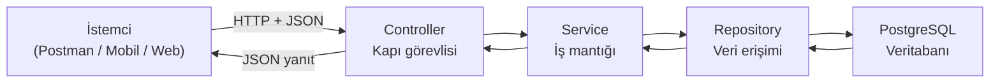

# Faz 1: Temel CRUD Altyapısı

**Proje:** Mini Food Delivery Backend  
**Faz:** N fazdan 1.  
**Odak:** Product entity + REST API (henüz ilişki yok)

> Bu rehber, Spring'e yeni başlayanlar için yazılmıştır. Her adımda **ne yaptığımızı**, **neden yaptığımızı**, **nasıl kullanıldığını** ve **gerçek dünyada nerede karşımıza çıktığını** açıklayan `💡 Yeni başlayan notu` kutuları bulacaksınız.

---

## İçindekiler

1. [Bu Fazın Amacı](#1-bu-fazın-amacı)
2. [Yeni Başlayanlar İçin: Spring Nasıl Düşünülür?](#2-yeni-başlayanlar-için-spring-nasıl-düşünülür)
3. [Ne İnşa Edeceksiniz](#3-ne-inşa-edeceksiniz)
4. [Teknoloji Yığını](#4-teknoloji-yığını)
5. [Adım Adım Uygulama](#5-adım-adım-uygulama)
6. [REST Endpoint'leri](#6-rest-endpointleri)
7. [Veritabanı Tablo Yapısı](#7-veritabanı-tablo-yapısı)
8. [Yaygın Başlangıç Hataları](#8-yaygın-başlangıç-hataları)
9. [Bu Fazda Neler Öğreneceksiniz](#9-bu-fazda-neler-öğreneceksiniz)
10. [Sözlük — Terimler Ne Demek?](#10-sözlük--terimler-ne-demek)

---

## 1. Bu Fazın Amacı

Kategori, sepet, sipariş veya kimlik doğrulama akışlarını eklemeden önce **sağlam bir temel** oluşturmanız gerekir.

Faz 1'de şunları yapacaksınız:

- Spring Boot'u PostgreSQL'e bağlamak
- Bir Java sınıfını veritabanı tablosuna eşlemek (JPA Entity)
- Spring Data JPA ile elle SQL yazmadan veri okumak ve yazmak
- **Product** yönetimi için temiz bir REST API sunmak
- Klasik katmanlı mimariyi anlamak: **Controller → Service → Repository → Veritabanı**

> **Bu fazın kuralı:** Basit tutun. Tek entity. İlişki yok. Temel doğrulama dışında iş kuralı yok.

---

## 2. Yeni Başlayanlar İçin: Spring Nasıl Düşünülür?

Spring ile ilk kez çalışıyorsanız, önce **büyük resmi** görmeniz işinizi kolaylaştırır. Bu bölümü okuduktan sonra aşağıdaki adımlar daha anlamlı gelecektir.

### 2.1 Spring Boot nedir?

Spring Boot, Java ile **web uygulaması ve API** yazmayı kolaylaştıran bir framework'tür. Siz iş mantığını yazarsınız; Spring şunları sizin yerinize halleder:

- Web sunucusunu başlatma (Tomcat)
- JSON ↔ Java dönüşümü
- Veritabanı bağlantısı
- Sınıflar arası bağımlılık bağlama (dependency injection)

**Gerçek dünyada:** Trendyol, Getir, bankacılık sistemleri, kurumsal ERP'ler gibi pek çok Java backend'i Spring (veya Spring Boot) üzerine kuruludur.

### 2.2 Bu projede veri nasıl akar?

Bir istemci (Postman, mobil uygulama, web sitesi) API'ye istek atar. İstek katman katman işlenir:



| Katman         | Günlük hayat benzetmesi | Sorumluluğu                                  |
| -------------- | ----------------------- | -------------------------------------------- |
| **Controller** | Restoranın garsonu      | İsteği alır, doğru yere iletir, yanıtı döner |
| **Service**    | Mutfak şefi             | Kuralları uygular, işi koordine eder         |
| **Repository** | Depo sorumlusu          | Veritabanından veri okur / yazar             |
| **Entity**     | Depodaki ürün etiketi   | Veritabanının Java'daki karşılığı            |
| **DTO**        | Menüdeki fiyat listesi  | Dış dünyaya gösterdiğiniz veri modeli        |

### 2.3 "Anotasyon" nedir?

Kodun üstüne yazdığınız `@Entity`, `@RestController`, `@Service` gibi etiketlere **anotasyon** denir. Spring bu etiketlere bakarak sınıfın ne iş yaptığını anlar ve ona göre davranır.

Örnek: `@RestController` görünce Spring der ki: _"Bu sınıf HTTP isteklerini karşılayacak, metot dönüş değerlerini JSON'a çevireceğim."_

### 2.4 Dependency Injection (bağımlılık enjeksiyonu) nedir?

`ProductController`, çalışmak için `ProductService`'e ihtiyaç duyar. Spring bunu **sizin elle `new ProductService()` demenize gerek kalmadan** constructor'a otomatik verir.

**Neden önemli?** Kod daha temiz olur, test yazmak kolaylaşır, bileşenler birbirine gevşek bağlanır.

### 2.5 Bu fazda hangi dosya ne işe yarar? (özet tablo)

| Dosya / sınıf                        | Kısa cevap                                           |
| ------------------------------------ | ---------------------------------------------------- |
| `application.properties`             | Uygulamanın ayar dosyası (DB şifresi, port vb.)      |
| `SecurityConfig`                     | Kim hangi URL'ye erişebilir — güvenlik kuralları     |
| `Product.java`                       | Veritabanındaki `products` tablosunun Java karşılığı |
| `ProductRepository`                  | Veritabanına SQL yazmadan erişim                     |
| `ProductRequest` / `ProductResponse` | API'ye giren ve çıkan veri modelleri                 |
| `ProductService`                     | Ürün ekleme, güncelleme, silme mantığı               |
| `ProductController`                  | `/products` URL'lerini yöneten REST katmanı          |
| `ProductExceptionHandler`            | Hataları düzgün JSON olarak döndürür                 |

---

## 3. Ne İnşa Edeceksiniz

Mini bir yemek sipariş uygulaması için **Product CRUD API**.

`Product`, bir restoranın sattığı bir ürünü temsil eder (ör. Margherita Pizza, Sezar Salatası).

| Alan          | Tip             | Örnek                             |
| ------------- | --------------- | --------------------------------- |
| `id`          | Long (otomatik) | `1`                               |
| `name`        | String          | `"Margherita Pizza"`              |
| `description` | String          | `"Domates, mozzarella, fesleğen"` |
| `price`       | BigDecimal      | `12.99`                           |
| `available`   | boolean         | `true`                            |

Henüz **yapmayacağınız** şeyler:

- Kategoriler
- Kullanıcılar / roller
- Sepet
- Siparişler
- Tablolar arası ilişkiler

---

## 4. Teknoloji Yığını

Her teknolojinin **neden** projede olduğunu bilmek, sadece "nasıl yazılır" bilgisinden daha değerlidir.

### Spring Boot 3.5

Ana framework. Tomcat, Jackson (JSON) ve dependency injection'ı otomatik yapılandırır; böylece iş koduna odaklanırsınız.

> #### 💡 Yeni başlayan notu — Spring Boot
>
> **Ne işe yarar?** Uygulamanın giriş noktasıdır; `main` metodunu çalıştırdığınızda tüm sistemi ayağa kaldırır.
>
> **Neden yapıyoruz?** Eskiden Java web projelerinde onlarca XML yapılandırma dosyası gerekirdi. Spring Boot bunların çoğunu otomatik halleder.
>
> **Nasıl kullanılır?** `./mvnw spring-boot:run` veya IDE'den `MiniDeliveryFoodApplication` sınıfını çalıştırırsınız.
>
> **Gerçek dünyada:** Mikroservisler, monolitik API'ler, batch işleri — hepsinin ortak başlangıç noktası bu tür bir `main` sınıfıdır.

Projenizin giriş noktası:

```java
@SpringBootApplication
public class MiniDeliveryFoodApplication {
    public static void main(String[] args) {
        SpringApplication.run(MiniDeliveryFoodApplication.class, args);
    }
}
```

### Spring Web

`@RestController`, `@GetMapping`, `@PostMapping` vb. sağlar. HTTP istekleri Java metot çağrılarına; dönüş değerleri JSON yanıtlarına dönüşür.

> #### 💡 Yeni başlayan notu — Spring Web
>
> **Ne işe yarar?** Tarayıcı, mobil uygulama veya Postman'den gelen HTTP isteklerini Java metotlarına bağlar.
>
> **Neden yapıyoruz?** Backend'in dış dünyayla konuşma dili HTTP'dir. Spring Web bu protokolü sizin için soyutlar.
>
> **Gerçek dünyada:** Bir yemek sipariş uygulamasında "menüyü getir" butonuna basıldığında mobil uygulama `GET /products` çağırır — bu çağrı Spring Web sayesinde `ProductController` metoduna düşer.

### Spring Data JPA

JPA (Java Persistence API), Java nesnelerini veritabanı satırlarına eşler.  
`JpaRepository` size `findAll()`, `findById()`, `save()`, `deleteById()` metotlarını ücretsiz sunar.

> #### 💡 Yeni başlayan notu — JPA ve Repository
>
> **Ne işe yarar?** Java sınıfınızı (`Product`) veritabanı tablosuna (`products`) bağlar. `productRepository.save(product)` dediğinizde Hibernate arka planda `INSERT INTO products ...` SQL'ini üretir.
>
> **Neden yapıyoruz?** Her CRUD işlemi için elle SQL yazmak yavaş, hataya açık ve bakımı zordur.
>
> **Nasıl kullanılır?** Bir `interface` tanımlarsınız, Spring çalışma zamanında implementasyonu oluşturur. Siz `findAll()` gibi hazır metotları çağırırsınız.
>
> **Gerçek dünyada:** E-ticaret sitelerinde ürün listeleme, stok güncelleme, sipariş kaydetme gibi işlemlerin büyük kısmı JPA/Hibernate ile yapılır.

### PostgreSQL

Üretim ortamına uygun ilişkisel veritabanı. Veriler tiplenmiş sütunlara sahip tablolarda saklanır.

> #### 💡 Yeni başlayan notu — PostgreSQL
>
> **Ne işe yarar?** Verilerin kalıcı olarak saklandığı yerdir. Uygulama kapanınca veriler silinmez.
>
> **Neden PostgreSQL?** Ücretsiz, güçlü, üretim ortamında yaygın kullanılır. MySQL veya SQL Server'a benzer mantıkla çalışır.
>
> **Gerçek dünyada:** Uber siparişleri, banka hesap hareketleri, Netflix izleme geçmişi — hepsi ilişkisel veya ilişkisel + NoSQL veritabanlarında tutulur.

### Projenizde zaten bulunan diğer bağımlılıklar

| Bağımlılık      | Faz 1'deki rolü                                                                                                                                    |
| --------------- | -------------------------------------------------------------------------------------------------------------------------------------------------- |
| Lombok          | Tekrarlayan kodu azaltır (`@Getter`, `@Setter` vb.)                                                                                                |
| Validation      | İstek DTO'larında `@NotBlank`, `@Positive`                                                                                                         |
| DevTools        | Geliştirme sırasında kod değişince otomatik yeniden başlatma                                                                                       |
| Spring Security | **pom.xml'de mevcut** — bkz. [Bölüm 8](#8-yaygın-başlangıç-hataları) ve [SecurityConfig açıklaması](#153-api-erisimine-izin-verin-spring-security) |
| SpringDoc       | İsteğe bağlı: `/swagger-ui.html` adresinde API dokümantasyonu                                                                                      |

> #### 💡 Yeni başlayan notu — Lombok ve Validation
>
> **Lombok (`@Getter`, `@Setter`, `@Builder`):** Tekrarlayan getter/setter/constructor kodunu otomatik üretir. `Product.java`'da 5 alan için 50+ satır boilerplate yazmak yerine birkaç anotasyon yeter.
>
> **Validation (`@NotBlank`, `@Positive`):** "Bu alan boş olamaz", "fiyat pozitif olmalı" gibi kuralları kodda değil, DTO üzerinde tanımlarsınız. Spring istek gelince otomatik kontrol eder; hata varsa `400 Bad Request` döner.
>
> **Gerçek dünyada:** Form doğrulama hem frontend'de (anında geri bildirim) hem backend'de (güvenlik — istemci kuralları atlayabilir) yapılır. Backend validation şarttır.

---

## 5. Adım Adım Uygulama

### Adım 0 — Ön Gereksinimler

Kurun ve doğrulayın:

- **JDK 21** — `java -version`
- **Maven** — projeyle gelen wrapper: `./mvnw` (Mac/Linux) veya `mvnw.cmd` (Windows)
- **PostgreSQL** — yerelde veya Docker ile çalışıyor olmalı
- **IDE** — IntelliJ IDEA veya Java eklentili VS Code
- **API istemcisi** — Postman, Insomnia veya `curl`

**Paket adı:** `com.cavus.mini_delivery_food`  
(Java paket adlarında tire geçersizdir; Spring Initializr alt çizgi kullanır.)

---

### Adım 1 — Proje Kurulumu

Projeniz zaten oluşturulmuş durumda. `pom.xml` dosyasında şunların olduğunu doğrulayın:

- `spring-boot-starter-web`
- `spring-boot-starter-data-jpa`
- `postgresql` (runtime)
- `lombok`
- `spring-boot-starter-validation`

#### 1.1 PostgreSQL veritabanını oluşturun

`psql` veya pgAdmin ile:

```sql
CREATE DATABASE mini_delivery_food;
```

#### 1.2 `application.properties` yapılandırması

`src/main/resources/application.properties` dosyasını düzenleyin:

```properties
spring.application.name=mini-delivery-food

# PostgreSQL
spring.datasource.url=jdbc:postgresql://localhost:5432/mini_delivery_food
spring.datasource.username=postgres
spring.datasource.password=buraya_sifrenizi_yazin

# JPA / Hibernate
spring.jpa.hibernate.ddl-auto=update
spring.jpa.show-sql=true
spring.jpa.properties.hibernate.format_sql=true
```

| Özellik           | Anlamı                                                                                                            |
| ----------------- | ----------------------------------------------------------------------------------------------------------------- |
| `ddl-auto=update` | Hibernate entity'lerden tabloları oluşturur/günceller (öğrenme için uygundur; üretimde Flyway/Liquibase kullanın) |
| `show-sql=true`   | SQL'i konsola yazdırır — öğrenmek için çok faydalı                                                                |

> #### 💡 Yeni başlayan notu — `application.properties`
>
> **Ne işe yarar?** Uygulamanın **ayar dosyasıdır**. Veritabanı adresi, kullanıcı adı, şifre, log seviyesi gibi değerler burada tutulur.
>
> **Neden ayrı bir dosya?** Kodu değiştirmeden farklı ortamlar (geliştirme, test, üretim) için farklı ayarlar kullanabilirsiniz. Geliştirmede `localhost`, üretimde AWS RDS adresi yazarsınız.
>
> **Nasıl kullanılır?** Spring Boot başlarken bu dosyayı otomatik okur. `spring.datasource.url` gibi anahtarları tanır ve veritabanı bağlantısını kurar.
>
> **Gerçek dünyada:** `.env` dosyası (Node.js) veya `application.yml` (Spring) — hepsi aynı fikir: **yapılandırmayı koddan ayırmak**.
>
> **Önemli satırlar:**
>
> - `spring.datasource.url` → PostgreSQL'in nerede olduğu (`localhost:5432`)
> - `spring.jpa.hibernate.ddl-auto=update` → Entity'lerinize bakıp tabloyu otomatik oluşturur/günceller
> - `show-sql=true` → Konsolda gerçek SQL'i görürsünüz; JPA'nın ne yaptığını öğrenmek için çok faydalı

#### 1.3 API erişimine izin verin (Spring Security)

Projenizde Spring Security var. Varsayılan olarak **tüm endpoint'ler 401 Unauthorized döner**.

Sadece Faz 1 için minimal bir güvenlik yapılandırması ekleyin:

**Dosya:** `src/main/java/com/cavus/mini_delivery_food/config/SecurityConfig.java`

```java
package com.cavus.mini_delivery_food.config;

import org.springframework.context.annotation.Bean;
import org.springframework.context.annotation.Configuration;
import org.springframework.security.config.annotation.web.builders.HttpSecurity;
import org.springframework.security.config.annotation.web.configuration.EnableWebSecurity;
import org.springframework.security.web.SecurityFilterChain;

@Configuration
@EnableWebSecurity
public class SecurityConfig {

    @Bean
    public SecurityFilterChain securityFilterChain(HttpSecurity http) throws Exception {
        http
            .csrf(csrf -> csrf.disable())
            .authorizeHttpRequests(auth -> auth.anyRequest().permitAll());
        return http.build();
    }
}
```

> #### 💡 Yeni başlayan notu — `SecurityConfig` (detaylı açıklama)
>
> Bu sınıfı görünce "neden var, ne yapıyor?" demeniz çok normal. Adım adım açıklayalım.
>
> ##### Spring Security nedir?
>
> Spring Security, uygulamanızın **kapısındaki güvenlik görevlisidir**. Her HTTP isteği bu kapıdan geçer. Kimlik doğrulama (login), yetkilendirme (bu kullanıcı admin mi?), CSRF koruması gibi işleri yönetir.
>
> **Gerçek dünyada:** Banka uygulamasında para transferi yapmadan önce giriş yapmanız, admin paneline sadece yöneticilerin girmesi, JWT token ile mobil API erişimi — hepsi Spring Security (veya benzeri) ile yapılır.
>
> ##### Neden `SecurityConfig` yazmak zorundayız?
>
> `pom.xml`'de `spring-boot-starter-security` bağımlılığı var. Bu bağımlılık eklendiğinde Spring Security **otomatik devreye girer** ve varsayılan olarak:
>
> - Tüm URL'leri kilitler
> - Her istekte giriş yapmanızı bekler
> - Postman'den `GET /products` çağırdığınızda **`401 Unauthorized`** alırsınız
>
> Faz 1'de henüz login sistemi yok. Bu yüzden geçici olarak "herkese izin ver" diyen bir yapılandırma yazıyoruz.
>
> ##### Kod satır satır ne yapıyor?
>
> | Satır / anotasyon           | Anlamı                                                                                                                  |
> | --------------------------- | ----------------------------------------------------------------------------------------------------------------------- |
> | `@Configuration`            | "Bu sınıf Spring'e ayar sınıfıdır" der                                                                                  |
> | `@EnableWebSecurity`        | Web güvenliğini aktif eder                                                                                              |
> | `@Bean SecurityFilterChain` | Güvenlik kurallarını tanımlayan bir nesne üretir                                                                        |
> | `csrf.disable()`            | CSRF korumasını kapatır. REST API'lerde genelde token tabanlı auth kullanılır; Faz 1'de basitleştirmek için kapatıyoruz |
> | `anyRequest().permitAll()`  | **Tüm isteklere izin ver** — kimlik kontrolü yok                                                                        |
>
> ##### Bu yapılandırma olmadan ne olur?
>
> ```
> GET http://localhost:8080/products
> → 401 Unauthorized
> ```
>
> SecurityConfig ile:
>
> ```
> GET http://localhost:8080/products
> → 200 OK + JSON ürün listesi
> ```
>
> ##### İleride ne olacak?
>
> Bu geçici bir çözümdür. Sonraki fazlarda `permitAll()` yerine şunları yazacaksınız:
>
> - `/auth/login` → herkese açık
> - `/products` GET → herkese açık (menü görüntüleme)
> - `/orders` POST → sadece giriş yapmış kullanıcı
> - `/admin/**` → sadece ADMIN rolü
>
> **Özet:** `SecurityConfig` = "Kim, hangi URL'ye, hangi koşulla erişebilir?" sorusunun cevabı. Faz 1'de öğrenmeye odaklanmak için kapıyı tamamen açık bırakıyoruz.

> Bunu ilerideki bir fazda gerçek kimlik doğrulama ile değiştireceksiniz.

#### 1.4 Uygulamayı çalıştırın

```bash
./mvnw spring-boot:run
```

Windows'ta:

```bash
mvnw.cmd spring-boot:run
```

Uygulama hatasız başlarsa kurulum tamamdır.

---

### Adım 2 — Product Entity Oluşturma

Entity, veritabanı satırının Java karşılığıdır.

**Önerilen paket yapısı:**

```
com.cavus.mini_delivery_food
├── MiniDeliveryFoodApplication.java
├── config/
│   └── SecurityConfig.java
├── product/
│   ├── Product.java
│   ├── ProductRepository.java
│   ├── ProductService.java
│   ├── ProductController.java
│   └── dto/
│       ├── ProductRequest.java
│       └── ProductResponse.java
```

**Dosya:** `src/main/java/com/cavus/mini_delivery_food/product/Product.java`

```java
package com.cavus.mini_delivery_food.product;

import jakarta.persistence.Column;
import jakarta.persistence.Entity;
import jakarta.persistence.GeneratedValue;
import jakarta.persistence.GenerationType;
import jakarta.persistence.Id;
import jakarta.persistence.Table;
import java.math.BigDecimal;
import lombok.AllArgsConstructor;
import lombok.Builder;
import lombok.Getter;
import lombok.NoArgsConstructor;
import lombok.Setter;

@Entity
@Table(name = "products")
@Getter
@Setter
@NoArgsConstructor
@AllArgsConstructor
@Builder
public class Product {

    @Id
    @GeneratedValue(strategy = GenerationType.IDENTITY)
    private Long id;

    @Column(nullable = false)
    private String name;

    @Column(length = 500)
    private String description;

    @Column(nullable = false, precision = 10, scale = 2)
    private BigDecimal price;

    @Column(nullable = false)
    private boolean available = true;
}
```

**Temel anotasyonlar:**

| Anotasyon                   | Amaç                                                                  |
| --------------------------- | --------------------------------------------------------------------- |
| `@Entity`                   | Sınıfı JPA entity olarak işaretler                                    |
| `@Table(name = "products")` | `products` tablosuna eşler                                            |
| `@Id`                       | Birincil anahtar                                                      |
| `@GeneratedValue(IDENTITY)` | Veritabanı id'yi otomatik artırır (PostgreSQL `SERIAL` / `BIGSERIAL`) |
| `@Column`                   | Sütun kısıtları ve eşleme                                             |

**Fiyat için neden `BigDecimal`?**  
`float` ve `double` para birimlerinde yuvarlama hatası yapar. Para için her zaman `BigDecimal` kullanın.

Uygulamayı yeniden başlatın. Hibernate `products` tablosunu otomatik oluşturmalıdır.

> #### 💡 Yeni başlayan notu — Entity (`Product.java`)
>
> **Ne işe yarar?** Veritabanındaki **bir satırın** Java karşılığıdır. `Product` sınıfı = `products` tablosundaki bir kayıt.
>
> **Neden yapıyoruz?** Java ile çalışmak SQL satırlarıyla değil, nesnelerle daha doğaldır. `product.setName("Pizza")` demek, `UPDATE products SET name='Pizza'` demekten okunması kolaydır.
>
> **Nasıl kullanılır?** Hibernate (JPA implementasyonu) `@Entity` gördüğünde bu sınıftan tablo oluşturur. `productRepository.save(product)` dediğinizde satır veritabanına yazılır.
>
> **Gerçek dünyada:** Amazon'daki bir ürün, Spotify'taki bir şarkı, bankadaki bir hesap — hepsi backend'de bir entity sınıfına karşılık gelir.
>
> **Anotasyonları hatırlayın:**
>
> - `@Id` → Bu alan birincil anahtar (benzersiz kimlik)
> - `@GeneratedValue` → ID'yi veritabanı otomatik üretsin (1, 2, 3...)
> - `@Column(nullable = false)` → Bu sütun boş bırakılamaz
> - `@Table(name = "products")` → Tablo adı `products` olsun (sınıf adı `Product` olsa bile)

---

### Adım 3 — Repository Oluşturma

Repository, veri erişim katmanıdır. Temel CRUD için SQL yazmazsınız.

**Dosya:** `src/main/java/com/cavus/mini_delivery_food/product/ProductRepository.java`

```java
package com.cavus.mini_delivery_food.product;

import org.springframework.data.jpa.repository.JpaRepository;

public interface ProductRepository extends JpaRepository<Product, Long> {
}
```

`JpaRepository<Product, Long>` şu anlama gelir:

- Entity tipi: `Product`
- Birincil anahtar tipi: `Long`

Miras alınan metotlar: `findAll()`, `findById()`, `save()`, `deleteById()`, `existsById()`.

Spring çalışma zamanında implementasyonu oluşturur — siz yalnızca arayüzü tanımlarsınız.

> #### 💡 Yeni başlayan notu — Repository
>
> **Ne işe yarar?** Veritabanı ile konuşan **veri erişim katmanıdır**. CRUD işlemlerini (Create, Read, Update, Delete) soyutlar.
>
> **Neden interface yazıyoruz, implementasyon yok?** Spring Data JPA sihir gibi çalışır: siz boş bir `interface` yazarsınız, Spring başlangıçta otomatik olarak `ProductRepositoryImpl` benzeri bir sınıf üretir ve bean olarak kaydeder.
>
> **Nasıl kullanılır?** `ProductService` içinde `productRepository.findAll()` veya `save()` çağırırsınız. SQL yazmazsınız.
>
> **Gerçek dünyada:** "Stokta olan ürünleri getir", "Son 30 günün siparişlerini listele" gibi sorgular repository katmanında toplanır. İleride `findByAvailableTrue()` gibi metot isimleriyle özel sorgular da yazabilirsiniz — Spring isimden SQL üretir.
>
> **Neden Controller'dan doğrudan Repository çağırmıyoruz?** Katmanları karıştırmak bakımı zorlaştırır. Controller → Service → Repository sırası standart mimaridir.

---

### Adım 4 — DTO Oluşturma (Data Transfer Objects)

Entity'yi doğrudan API'de açmayın. DTO'ları şunlar için kullanın:

- İstemcilerin hangi alanları gönderip alacağını kontrol etmek
- Entity'yi kirletmeden doğrulama eklemek
- API sözleşmesini veritabanı şemasından ayırmak

**Dosya:** `src/main/java/com/cavus/mini_delivery_food/product/dto/ProductRequest.java`

```java
package com.cavus.mini_delivery_food.product.dto;

import jakarta.validation.constraints.NotBlank;
import jakarta.validation.constraints.NotNull;
import jakarta.validation.constraints.Positive;
import java.math.BigDecimal;
import lombok.Getter;
import lombok.Setter;

@Getter
@Setter
public class ProductRequest {

    @NotBlank(message = "Ürün adı zorunludur")
    private String name;

    private String description;

    @NotNull(message = "Fiyat zorunludur")
    @Positive(message = "Fiyat sıfırdan büyük olmalıdır")
    private BigDecimal price;

    private boolean available = true;
}
```

**Dosya:** `src/main/java/com/cavus/mini_delivery_food/product/dto/ProductResponse.java`

```java
package com.cavus.mini_delivery_food.product.dto;

import java.math.BigDecimal;
import lombok.Builder;
import lombok.Getter;

@Getter
@Builder
public class ProductResponse {

    private Long id;
    private String name;
    private String description;
    private BigDecimal price;
    private boolean available;
}
```

> #### 💡 Yeni başlayan notu — DTO (Data Transfer Object)
>
> **Ne işe yarar?** API ile dış dünya arasında taşınan **veri paketidir**. İstek için `ProductRequest`, yanıt için `ProductResponse` kullanıyoruz.
>
> **Neden Entity'yi doğrudan API'de kullanmıyoruz?**
>
> 1. **Güvenlik:** Entity'de `createdAt`, `internalCost` gibi alanlar olabilir — bunları istemciye göstermek istemezsiniz.
> 2. **Esneklik:** Veritabanı şeması değişse bile API sözleşmesi aynı kalabilir.
> 3. **Doğrulama:** `@NotBlank`, `@Positive` gibi kurallar istek DTO'suna yazılır; entity kirlenmez.
> 4. **Farklı ihtiyaçlar:** Oluştururken `id` gönderilmez; yanıtta `id` döner. Ayrı modeller bunu kolaylaştırır.
>
> **Nasıl kullanılır?**
>
> - İstemci POST ile `ProductRequest` JSON'u gönderir
> - Service bunu `Product` entity'sine çevirir, kaydeder
> - Service `ProductResponse` oluşturup Controller'a döner
> - Controller JSON olarak istemciye yollar
>
> **Gerçek dünyada:** Instagram API'si size profil fotoğrafı URL'si döner; veritabanındaki tüm kullanıcı tablosunu açmaz. DTO tam olarak bu ayrımı sağlar.
>
> **`ProductRequest` vs `ProductResponse`:**
>
> |              | ProductRequest           | ProductResponse      |
> | ------------ | ------------------------ | -------------------- |
> | Yön          | İstemci → Sunucu         | Sunucu → İstemci     |
> | `id` var mı? | Hayır (DB üretir)        | Evet                 |
> | Doğrulama    | `@NotBlank`, `@Positive` | Yok (biz üretiyoruz) |

---

### Adım 5 — Service Katmanı Oluşturma

Service iş mantığını içerir. Faz 1'de incedir: DTO eşleme, repository çağrısı, "bulunamadı" durumu.

**Dosya:** `src/main/java/com/cavus/mini_delivery_food/product/ProductService.java`

```java
package com.cavus.mini_delivery_food.product;

import com.cavus.mini_delivery_food.product.dto.ProductRequest;
import com.cavus.mini_delivery_food.product.dto.ProductResponse;
import java.util.List;
import org.springframework.stereotype.Service;
import org.springframework.transaction.annotation.Transactional;

@Service
@Transactional
public class ProductService {

    private final ProductRepository productRepository;

    public ProductService(ProductRepository productRepository) {
        this.productRepository = productRepository;
    }

    @Transactional(readOnly = true)
    public List<ProductResponse> findAll() {
        return productRepository.findAll().stream()
                .map(this::toResponse)
                .toList();
    }

    @Transactional(readOnly = true)
    public ProductResponse findById(Long id) {
        Product product = productRepository.findById(id)
                .orElseThrow(() -> new ProductNotFoundException(id));
        return toResponse(product);
    }

    public ProductResponse create(ProductRequest request) {
        Product product = Product.builder()
                .name(request.getName())
                .description(request.getDescription())
                .price(request.getPrice())
                .available(request.isAvailable())
                .build();
        return toResponse(productRepository.save(product));
    }

    public ProductResponse update(Long id, ProductRequest request) {
        Product product = productRepository.findById(id)
                .orElseThrow(() -> new ProductNotFoundException(id));

        product.setName(request.getName());
        product.setDescription(request.getDescription());
        product.setPrice(request.getPrice());
        product.setAvailable(request.isAvailable());

        return toResponse(productRepository.save(product));
    }

    public void delete(Long id) {
        if (!productRepository.existsById(id)) {
            throw new ProductNotFoundException(id);
        }
        productRepository.deleteById(id);
    }

    private ProductResponse toResponse(Product product) {
        return ProductResponse.builder()
                .id(product.getId())
                .name(product.getName())
                .description(product.getDescription())
                .price(product.getPrice())
                .available(product.isAvailable())
                .build();
    }
}
```

**Dosya:** `src/main/java/com/cavus/mini_delivery_food/product/ProductNotFoundException.java`

```java
package com.cavus.mini_delivery_food.product;

public class ProductNotFoundException extends RuntimeException {

    public ProductNotFoundException(Long id) {
        super("Ürün bulunamadı, id: " + id);
    }
}
```

**Dosya:** `src/main/java/com/cavus/mini_delivery_food/product/ProductExceptionHandler.java`

```java
package com.cavus.mini_delivery_food.product;

import java.time.Instant;
import java.util.Map;
import org.springframework.http.HttpStatus;
import org.springframework.http.ResponseEntity;
import org.springframework.web.bind.annotation.ExceptionHandler;
import org.springframework.web.bind.annotation.RestControllerAdvice;

@RestControllerAdvice
public class ProductExceptionHandler {

    @ExceptionHandler(ProductNotFoundException.class)
    public ResponseEntity<Map<String, Object>> handleNotFound(ProductNotFoundException ex) {
        return ResponseEntity.status(HttpStatus.NOT_FOUND).body(Map.of(
                "timestamp", Instant.now().toString(),
                "status", 404,
                "error", "Bulunamadı",
                "message", ex.getMessage()
        ));
    }
}
```

**Neden constructor injection?**  
Spring `ProductRepository`'yi otomatik enjekte eder. Alanlara `@Autowired` yerine constructor injection tercih edin — bağımlılıklar açık olur ve test etmek kolaylaşır.

> #### 💡 Yeni başlayan notu — Service katmanı
>
> **Ne işe yarar?** **İş mantığının** yaşadığı yerdir. "Ürün bulunamazsa hata fırlat", "DTO'yu entity'ye çevir", "kaydet ve yanıt oluştur" gibi kurallar burada yazılır.
>
> **Neden Controller'da değil?** Aynı mantığı yarın mobil API, admin paneli ve batch job da kullanabilir. Service'e yazarsanız tek yerden yönetirsiniz.
>
> **Nasıl kullanılır?** `@Service` ile Spring bu sınıfı yönetir. `@Transactional` bir metot içindeki tüm DB işlemlerinin tek bir transaction'da (atomik) yapılmasını sağlar — biri başarısız olursa hepsi geri alınır.
>
> **`@Transactional(readOnly = true)` ne demek?** Sadece okuma yapan metotlarda (findAll, findById) performans için "bu metot veri değiştirmiyor" bilgisini verir.
>
> **Gerçek dünyada:** Sipariş verirken stok kontrolü, indirim hesaplama, minimum sepet tutarı — bunların hepsi Service katmanındadır. Controller sadece "sipariş isteği geldi" der, Service gerisini halleder.
>
> **`toResponse()` private metodu:** Entity → DTO dönüşümünü tek yerde toplar. Kod tekrarını önler (DRY prensibi).

> #### 💡 Yeni başlayan notu — Exception Handler
>
> **Ne işe yarar?** Hataları yakalayıp istemciye **düzgün JSON** olarak döndürür.
>
> **Neden yapıyoruz?** `ProductNotFoundException` fırlatıldığında Spring varsayılan olarak çirkin bir HTML hata sayfası veya 500 Internal Server Error verebilir. `@RestControllerAdvice` ile "404 + anlamlı mesaj" döneriz.
>
> **Nasıl kullanılır?** `@ExceptionHandler(ProductNotFoundException.class)` — bu tip hata olunca bu metot çalışır.
>
> **Gerçek dünyada:** Tüm API'ler tutarlı hata formatı kullanır. Örn: `{ "status": 404, "message": "Ürün bulunamadı" }` — mobil uygulama buna göre kullanıcıya mesaj gösterir.

---

### Adım 6 — Controller Oluşturma

Controller HTTP'i yönetir: URL'ler, durum kodları, istek/yanıt gövdeleri.

**Dosya:** `src/main/java/com/cavus/mini_delivery_food/product/ProductController.java`

```java
package com.cavus.mini_delivery_food.product;

import com.cavus.mini_delivery_food.product.dto.ProductRequest;
import com.cavus.mini_delivery_food.product.dto.ProductResponse;
import jakarta.validation.Valid;
import java.net.URI;
import java.util.List;
import org.springframework.http.ResponseEntity;
import org.springframework.web.bind.annotation.DeleteMapping;
import org.springframework.web.bind.annotation.GetMapping;
import org.springframework.web.bind.annotation.PathVariable;
import org.springframework.web.bind.annotation.PostMapping;
import org.springframework.web.bind.annotation.PutMapping;
import org.springframework.web.bind.annotation.RequestBody;
import org.springframework.web.bind.annotation.RequestMapping;
import org.springframework.web.bind.annotation.RestController;
import org.springframework.web.servlet.support.ServletUriComponentsBuilder;

@RestController
@RequestMapping("/products")
public class ProductController {

    private final ProductService productService;

    public ProductController(ProductService productService) {
        this.productService = productService;
    }

    @GetMapping
    public List<ProductResponse> getAll() {
        return productService.findAll();
    }

    @GetMapping("/{id}")
    public ProductResponse getById(@PathVariable Long id) {
        return productService.findById(id);
    }

    @PostMapping
    public ResponseEntity<ProductResponse> create(@Valid @RequestBody ProductRequest request) {
        ProductResponse created = productService.create(request);
        URI location = ServletUriComponentsBuilder.fromCurrentRequest()
                .path("/{id}")
                .buildAndExpand(created.getId())
                .toUri();
        return ResponseEntity.created(location).body(created);
    }

    @PutMapping("/{id}")
    public ProductResponse update(@PathVariable Long id, @Valid @RequestBody ProductRequest request) {
        return productService.update(id, request);
    }

    @DeleteMapping("/{id}")
    public ResponseEntity<Void> delete(@PathVariable Long id) {
        productService.delete(id);
        return ResponseEntity.noContent().build();
    }
}
```

**İstek akışı:**

```
HTTP İsteği
    → ProductController
    → ProductService
    → ProductRepository
    → PostgreSQL
    ← JSON Yanıtı
```

> #### 💡 Yeni başlayan notu — Controller
>
> **Ne işe yarar?** REST API'nin **dış kapısıdır**. URL'leri, HTTP metotlarını (GET/POST/PUT/DELETE) ve durum kodlarını (200, 201, 404) yönetir.
>
> **Neden ince tutuyoruz?** Controller'da iş mantığı olmamalı. Sadece: isteği al → Service'e ver → sonucu döndür.
>
> **Önemli anotasyonlar:**
>
> | Anotasyon                      | Ne yapar?                             | Örnek                      |
> | ------------------------------ | ------------------------------------- | -------------------------- |
> | `@RestController`              | Bu sınıf REST endpoint'leri sunar     | —                          |
> | `@RequestMapping("/products")` | Tüm metotlar `/products` altında      | `/products`, `/products/1` |
> | `@GetMapping`                  | HTTP GET — veri okuma                 | Listele, tek kayıt getir   |
> | `@PostMapping`                 | HTTP POST — yeni kayıt                | Ürün oluştur               |
> | `@PutMapping`                  | HTTP PUT — tam güncelleme             | Tüm alanları değiştir      |
> | `@DeleteMapping`               | HTTP DELETE — silme                   | Ürün sil                   |
> | `@PathVariable`                | URL'deki `{id}` değerini alır         | `/products/5` → id=5       |
> | `@RequestBody`                 | JSON gövdesini Java nesnesine çevirir | POST/PUT istekleri         |
> | `@Valid`                       | DTO doğrulamasını tetikler            | Boş isim → 400             |
>
> **`ResponseEntity.created(location)` neden?** REST standartlarına göre yeni kayıt oluşturulunca `201 Created` ve yeni kaynağın URL'si (`Location` header) dönmek iyi pratiktir.
>
> **Gerçek dünyada:** Yemek uygulamasında "Sepete ekle" butonu `POST /cart/items` çağırır. Bu istek `CartController`'a düşer; controller sepet service'ine iletir.

---

## 6. REST Endpoint'leri

Temel URL: `http://localhost:8080`

| Metot  | Endpoint         | Açıklama             | Başarılı durum kodu                   |
| ------ | ---------------- | -------------------- | ------------------------------------- |
| GET    | `/products`      | Tüm ürünleri listele | `200 OK`                              |
| GET    | `/products/{id}` | Tek ürün getir       | `200 OK` veya `404 Not Found`         |
| POST   | `/products`      | Ürün oluştur         | `201 Created`                         |
| PUT    | `/products/{id}` | Ürün güncelle        | `200 OK` veya `404 Not Found`         |
| DELETE | `/products/{id}` | Ürün sil             | `204 No Content` veya `404 Not Found` |

### Örnek istekler (curl)

**Ürün oluşturma**

```bash
curl -X POST http://localhost:8080/products \
  -H "Content-Type: application/json" \
  -d "{\"name\":\"Margherita Pizza\",\"description\":\"Domates, mozzarella, fesleğen\",\"price\":12.99,\"available\":true}"
```

**Tüm ürünleri listeleme**

```bash
curl http://localhost:8080/products
```

**Id ile getirme**

```bash
curl http://localhost:8080/products/1
```

**Güncelleme**

```bash
curl -X PUT http://localhost:8080/products/1 \
  -H "Content-Type: application/json" \
  -d "{\"name\":\"Margherita Pizza (Büyük)\",\"description\":\"Büyük boy\",\"price\":15.99,\"available\":true}"
```

**Silme**

```bash
curl -X DELETE http://localhost:8080/products/1
```

### Örnek JSON gövdeleri

**İstek (POST / PUT):**

```json
{
  "name": "Sezar Salatası",
  "description": "Marul, parmesan, kruton",
  "price": 8.5,
  "available": true
}
```

**Yanıt (GET / POST / PUT):**

```json
{
  "success": true,
  "code": 200,
  "message": "Ürün başarıyla getirildi",
  "data": {
    "id": "3e8b14eb-b0b2-46af-83c7-d295dde71d45",
    "name": "Sezar Salatası",
    "description": "Marul, parmesan, kruton",
    "price": 8.5,
    "imageUrl": "https://example.com/sezar-salatasi.jpg",
    "stock": 100,
    "unit": "adet",
    "active": true
  }
}
```

**Bulunamadı yanıtı (`404 Not Found`):**

```json
{
  "success": false,
  "code": 404,
  "message": "Ürün bulunamadı, id: 3e8b14eb-b0b2-46af-83c7-d295dde71d45",
  "data": null
}
```

### Doğrulama hataları (`400 Bad Request`)

`name` boşsa veya `price` eksik/negatifse Spring Validation alan detaylarıyla birlikte `400` döner.

### Swagger UI (isteğe bağlı)

SpringDoc classpath'te olduğunda şu adresi açın:

```
http://localhost:8080/swagger-ui.html
```

Tüm endpoint'leri tarayıcıdan deneyebilirsiniz.

> #### 💡 Yeni başlayan notu — REST API'yi test etmek
>
> **Postman / Insomnia:** Görsel arayüzle istek atarsınız. Body → raw → JSON seçip ürün oluşturabilirsiniz. Başlangıç için en kolay yol budur.
>
> **curl:** Terminalden hızlı test. Script'lere gömülebilir.
>
> **Swagger UI:** Tarayıcıda API dokümantasyonu + "Try it out" butonu. Takım içi paylaşım için idealdir.
>
> **Gerçek dünyada:** Backend geliştirici önce Postman collection oluşturur; QA ekibi ve mobil geliştiriciler bununla test eder. CI/CD pipeline'da otomatik API testleri de curl veya RestAssured ile çalışır.

---

## 7. Veritabanı Tablo Yapısı

Uygulama `ddl-auto=update` ile çalıştıktan sonra PostgreSQL'de şuna benzer bir tablo oluşur:

### Tablo: `products`

| Sütun         | SQL tipi (yaklaşık) | Nullable | Notlar                                        |
| ------------- | ------------------- | -------- | --------------------------------------------- |
| `id`          | `BIGINT`            | HAYIR    | Birincil anahtar, otomatik üretilir           |
| `name`        | `VARCHAR(255)`      | HAYIR    | Ürün adı                                      |
| `description` | `VARCHAR(500)`      | EVET     | İsteğe bağlı metin                            |
| `price`       | `NUMERIC(10,2)`     | HAYIR    | `@Column(precision = 10, scale = 2)` kaynaklı |
| `available`   | `BOOLEAN`           | HAYIR    | Java'da varsayılan `true`                     |

### PostgreSQL'de inceleme

```sql
\d products

SELECT * FROM products;
```

### Java'nın SQL'e eşlemesi

```
Product.java          →    products tablosu
─────────────────          ─────────────────
Long id               →    id (PK, otomatik artan)
String name           →    name
String description    →    description
BigDecimal price      →    price
boolean available     →    available
```

Faz 1'de yabancı anahtar yok — tek, bağımsız tablo.

> #### 💡 Yeni başlayan notu — Veritabanını anlamak
>
> **Entity ile tablo aynı şey mi?** Mantıksal olarak evet, fiziksel olarak biri Java sınıfı diğeri PostgreSQL tablosu. JPA ikisini senkron tutar.
>
> **Veriyi nerede görürüm?** pgAdmin, DBeaver veya `psql` ile `SELECT * FROM products;` çalıştırın. Postman'den eklediğiniz ürünler burada görünür.
>
> **Uygulama kapandığında veri gider mi?** Hayır. PostgreSQL kalıcı depolamadır. Sadece bellekte (RAM) tutulan veriler uygulama kapanınca silinir.

---

## 8. Yaygın Başlangıç Hataları

### 1. Spring Security'nin her şeyi engellemesini unutmak

Belirti: Tüm istekler `401 Unauthorized` döner.  
Çözüm: Faz 1 için `permitAll()` içeren `SecurityConfig` ekleyin veya sonra gerçek auth yapılandırın.

**Hatırlatma:** `pom.xml`'e Security eklediğiniz anda Spring tüm URL'leri kilitler. Bu bir hata değil, güvenlik özelliğidir — öğrenme aşamasında geçici olarak açmanız gerekir. Detay: [SecurityConfig açıklaması](#153-api-erisimine-izin-verin-spring-security).

### 2. Yanlış veritabanı URL'si veya şifre

Belirti: Başlangıçta `Connection refused` veya `password authentication failed`.  
Çözüm: `application.properties` içindeki `spring.datasource.*` değerlerini kontrol edin. PostgreSQL'in çalıştığından emin olun.

### 3. Para için `double` kullanmak

Belirti: JSON veya veritabanında `12.989999999` gibi fiyatlar.  
Çözüm: Para birimi için her yerde `BigDecimal` kullanın.

### 4. İş mantığını controller'a koymak

Belirti: Şişkin controller'lar, test etmesi zor kod.  
Çözüm: Controller = yalnızca HTTP. Service = mantık. Repository = veri erişimi.

### 5. API'den doğrudan entity döndürmek

Belirti: Sıkı bağlılık; ileride alan gizleyemez veya DB'yi istemcileri kırmadan değiştiremezsiniz.  
Çözüm: `ProductRequest` / `ProductResponse` DTO'larını kullanın.

### 6. `@RequestBody` üzerinde `@Valid` eksikliği

Belirti: Geçersiz veri veritabanına kaydedilir.  
Çözüm: Controller parametresine `@Valid` ve DTO'ya doğrulama anotasyonları ekleyin.

### 7. Paylaşımlı ortamlarda `ddl-auto=create`

Belirti: Her yeniden başlatmada veriler silinir.  
Çözüm: Yerelde öğrenirken `update`; üretimde `validate` + migration (Flyway).

### 8. PUT ile PATCH'i karıştırmak

- **PUT** (Faz 1): Tüm kaynağı değiştirir — tüm alanları gönderin.
- **PATCH** (ileride): Yalnızca bazı alanları günceller.

### 9. Yanlış HTTP durum kodları

| İşlem            | Doğru durum kodu  |
| ---------------- | ----------------- |
| Oluşturma        | `201 Created`     |
| Okuma            | `200 OK`          |
| Güncelleme       | `200 OK`          |
| Silme            | `204 No Content`  |
| Bulunamadı       | `404 Not Found`   |
| Doğrulama hatası | `400 Bad Request` |

### 10. Paket adında tire kullanmak

Geçersiz: `com.cavus.mini-delivery-food`  
Geçerli: `com.cavus.mini_delivery_food`

### 11. Öğrenirken `show-sql` açmamak

Hibernate'in gerçekte ne yaptığını daha az öğrenirsiniz. Geliştirmede açın, konsoldaki SQL'i okuyun.

### 12. Controller'dan doğrudan repository çağırmak

Katmanları bozan kısayol. Her zaman service üzerinden gidin.

---

## 9. Bu Fazda Neler Öğreneceksiniz

Faz 1'i tamamladığınızda şunları anlayacaksınız:

| Konu                        | Kazanım                                                                           |
| --------------------------- | --------------------------------------------------------------------------------- |
| **Spring Boot başlatma**    | `@SpringBootApplication` uygulamayı nasıl ayağa kaldırır ve otomatik yapılandırma |
| **Katmanlı mimari**         | Sorumlulukların ayrılması: Controller / Service / Repository                      |
| **Dependency injection**    | Spring bileşenleri constructor ile bağlar                                         |
| **JPA entity'leri**         | Java sınıflarının anotasyonlarla SQL tablolarına eşlenmesi                        |
| **Spring Data JPA**         | Tekrarlayan SQL olmadan repository kullanımı                                      |
| **REST tasarımı**           | Kaynaklar, HTTP fiilleri, durum kodları, JSON gövdeler                            |
| **DTO deseni**              | API modelleri ile kalıcılık modellerinin ayrımı                                   |
| **Validation**              | Jakarta Validation ile bildirimsel girdi kontrolü                                 |
| **Exception handling**      | Tutarlı hata yanıtları için `@RestControllerAdvice`                               |
| **PostgreSQL entegrasyonu** | JDBC URL, kimlik bilgileri, şema oluşturma                                        |
| **Geliştirici iş akışı**    | Uygulamayı çalıştırma, curl/Postman ile test, SQL loglarını okuma                 |

---

## 10. Sözlük — Terimler Ne Demek?

| Terim                    | Basit açıklama                                | Bu projede örnek                        |
| ------------------------ | --------------------------------------------- | --------------------------------------- |
| **API**                  | Uygulamanın dışarıya açtığı arayüz            | `GET /products`                         |
| **REST**                 | HTTP ile kaynak yönetimi stili                | GET=listele, POST=oluştur               |
| **JSON**                 | Veri alışverişi formatı                       | `{"name":"Pizza","price":12.99}`        |
| **CRUD**                 | Create, Read, Update, Delete                  | POST, GET, PUT, DELETE                  |
| **Entity**               | DB tablosunun Java karşılığı                  | `Product.java`                          |
| **DTO**                  | API'ye giren/çıkan veri modeli                | `ProductRequest`, `ProductResponse`     |
| **Repository**           | Veritabanı erişim katmanı                     | `ProductRepository`                     |
| **Service**              | İş mantığı katmanı                            | `ProductService`                        |
| **Controller**           | HTTP isteklerini karşılayan katman            | `ProductController`                     |
| **Bean**                 | Spring'in yönettiği nesne                     | `@Service`, `@RestController` sınıfları |
| **Dependency Injection** | Bağımlılıkları Spring'in vermesi              | Controller'a Service enjekte edilir     |
| **JPA / Hibernate**      | Java ↔ SQL eşlemesi                           | `@Entity`, `@Column`                    |
| **Transaction**          | Atomik DB işlemi grubu                        | `@Transactional`                        |
| **HTTP Status Code**     | İsteğin sonucu                                | 200=OK, 404=Bulunamadı, 401=Yetkisiz    |
| **Spring Security**      | Kimlik ve erişim kontrolü                     | `SecurityConfig`                        |
| **Migration**            | Veritabanı şema değişikliklerini versiyonlama | Flyway (Faz 2+)                         |

---

## Faz 1 Kontrol Listesi

Faz 2'ye geçmeden önce bunları doğrulayın:

- [ ] Uygulama başlıyor ve PostgreSQL'e bağlanıyor
- [ ] Veritabanında `products` tablosu var
- [ ] `GET /products` liste döndürüyor (boş veya dolu)
- [ ] `POST /products` satır oluşturuyor ve `201` dönüyor
- [ ] `GET /products/{id}` tek ürün veya `404` dönüyor
- [ ] `PUT /products/{id}` mevcut ürünü güncelliyor
- [ ] `DELETE /products/{id}` ürünü siliyor ve `204` dönüyor
- [ ] Geçersiz gövde doğrulama mesajıyla `400` dönüyor
- [ ] Kod `product` paketi altında net katmanlarla organize

---

## Sırada Ne Var? (Faz 2 önizlemesi)

Faz 2 genellikle şunları getirir:

- **Category** entity ve `@ManyToOne` / `@OneToMany` ilişkileri
- Ürünleri kategoriye göre filtreleme
- `GET /products` üzerinde sayfalama ve sıralama
- Düzgün global exception handling ve API hata formatı
- `ddl-auto=update` yerine Flyway ile veritabanı migration'ları

Önce Faz 1'i iyi öğrenin. Temiz bir CRUD API, sonrasında gelen her şeyin omurgasıdır.

---

_Mini Food Delivery Backend — Faz 1 Öğrenme Rehberi_
