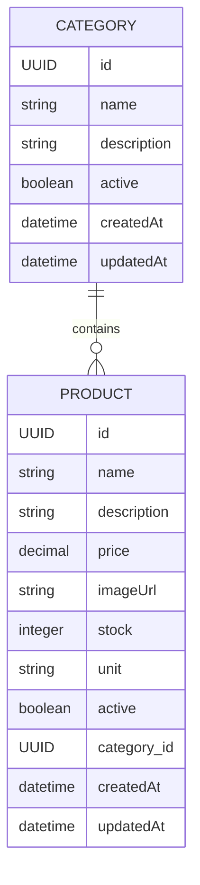

# Faz 2: Category Sistemi + Entity İlişkileri

**Proje:** Mini Food Delivery Backend  
**Faz:** N fazdan 2.  
**Odak:** Category entity + Product -> Category ilişkisi  
**Henüz yok:** Sepet, sipariş, ödeme, kullanıcıya özel ürün listesi

> Bu rehber, Faz 1'de kurulan Product CRUD altyapısının üzerine inşa edilir. Bu fazın ana amacı, artık tek tabloyla değil, **birbiriyle ilişkili iki tabloyla** çalışmayı öğrenmektir.

> **Dokümantasyon kaynağı:** Bu rehberdeki Spring Data JPA repository yaklaşımı ve `findBy...` query method örnekleri, Context7 üzerinden çekilen güncel **Spring Data JPA** dokümantasyonuna dayandırılmıştır: `/spring-projects/spring-data-jpa`.

> **Bu fazı nasıl okumalısınız?** Kod bloklarını sadece kopyalanacak metin gibi düşünmeyin. Her anotasyonun yanında "Spring bunu görünce ne yapıyor?", "Veritabanında karşılığı ne?", "Neden buna ihtiyaç duyuyoruz?" sorularını sorun. Bu rehber özellikle bu sorulara cevap vermek için detaylandırılmıştır.

---

## İçindekiler

1. [Bu Fazın Amacı](#1-bu-fazın-amacı)
2. [Category Sistemi Gerçek Projelerde Neden Önemlidir?](#2-category-sistemi-gerçek-projelerde-neden-önemlidir)
3. [Bu Fazda İnşa Edilecek Yapı](#3-bu-fazda-inşa-edilecek-yapı)
4. [Entity'ler](#4-entityler)
5. [İlişki Mantığı](#5-ilişki-mantığı)
6. [Veritabanı Şeması](#6-veritabanı-şeması)
7. [Adım Adım Uygulama](#7-adım-adım-uygulama)
8. [API Endpoint'leri](#8-api-endpointleri)
9. [DTO Kullanımı: Bu Fazda Neden Daha Önemli?](#9-dto-kullanımı-bu-fazda-neden-daha-önemli)
10. [Yaygın Hatalar](#10-yaygın-hatalar)
11. [Bu Fazda Neler Öğreneceksiniz](#11-bu-fazda-neler-öğreneceksiniz)
12. [Sözlük](#12-sözlük)

---

## 1. Bu Fazın Amacı

Faz 1'de sistemde sadece `Product` vardı. Bu bilinçli olarak basit tutuldu; önce entity, repository, service, controller ve DTO akışı öğrenildi.

Faz 2'de artık ürünleri kategorilere bağlayacaksınız.

Örnek:

| Category | Products |
| -------- | -------- |
| Pizza | Margherita Pizza, Pepperoni Pizza |
| Burger | Cheeseburger, Chicken Burger |
| Drink | Ayran, Cola, Water |

Bu fazda hedeflenen kazanımlar:

- `Category` adında yeni bir entity oluşturmak
- `Product` entity'sine kategori ilişkisi eklemek
- `@ManyToOne` ve `@OneToMany` anotasyonlarını öğrenmek
- Foreign key mantığını anlamak
- Repository'de ilişkili veri sorgulamak
- Service katmanında iki entity'yi birlikte yönetmek
- DTO'larda entity ilişkilerini güvenli şekilde göstermek
- JSON response içinde circular reference problemini önlemek

> **Bu fazın kuralı:** Sepet ve sipariş sistemine geçmeden önce ürünlerin hangi kategoriye ait olduğunu düzgün modelleyin. Gerçek backend projelerinde büyük yapıların temeli doğru entity ilişkileridir.

---

## 2. Category Sistemi Gerçek Projelerde Neden Önemlidir?

Kategori sistemi küçük görünür ama gerçek dünyada çok temel bir yapıdır.

Bir yemek sipariş uygulamasında kullanıcı genelde tüm ürünleri karışık görmek istemez. Menü şu şekilde bölünür:

- Pizzalar
- Burgerler
- Tatlılar
- İçecekler
- Kampanyalı ürünler

Bu ayrım sadece ekranda düzen sağlamak için değildir. Backend tarafında da önemli faydaları vardır.

### 2.1 Kullanıcı deneyimi

Mobil uygulama veya web arayüzü ürünleri kategoriye göre listeler.

Örnek:

```http
GET /api/v1/categories
GET /api/v1/categories/{categoryId}/products
```

Böylece frontend önce kategorileri çeker, kullanıcı bir kategori seçtiğinde sadece o kategoriye ait ürünleri listeler.

### 2.2 Yönetim paneli

Restoran sahibi veya admin paneli ürünleri kategoriye göre yönetir.

Örnek işlemler:

- "Pizza" kategorisine yeni ürün ekleme
- "İçecekler" kategorisini pasife alma
- "Tatlılar" kategorisindeki ürünleri listeleme
- Yanlış kategoriye atanmış ürünü düzeltme

### 2.3 Veri organizasyonu

Kategori yoksa ürün tablosu büyüdükçe kontrol zorlaşır.

Kötü yaklaşım:

| product_name | category_name |
| ------------ | ------------- |
| Margherita Pizza | Pizza |
| Pepperoni Pizza | pizza |
| Cheeseburger | Burger |
| Cola | Drinks |
| Ayran | Drink |

Burada kategori adı ürün satırının içinde string olarak tutulursa aynı kategori farklı şekillerde yazılabilir: `Drink`, `Drinks`, `drink`, `İçecek`.

Doğru yaklaşım:

- Kategoriler ayrı tabloda tutulur.
- Product sadece `category_id` ile kategoriye bağlanır.
- Kategori adı tek yerde saklanır.

### 2.4 Gelecek fazlara hazırlık

İleride sepet ve sipariş sistemi geldiğinde ürünlerin kategori bilgisi hâlâ önemli olacak.

Örnek:

- "İçeceklerde %20 indirim"
- "Tatlı kategorisinden bir ürün alana kampanya"
- "Restoran menüsünü kategori bazlı göster"
- "En çok satan kategori raporu"

Kategori sistemi bu yüzden sadece basit bir listeleme özelliği değil, ilerideki iş kurallarının temelidir.

---

## 3. Bu Fazda İnşa Edilecek Yapı

Bu faz sonunda sistemde iki ana entity olacak:



Okunuşu:

- Bir `Category`, birden fazla `Product` içerebilir.
- Bir `Product`, yalnızca bir `Category`'ye ait olur.
- İlişki veritabanında `products.category_id` kolonu ile tutulur.

---

## 4. Entity'ler

### 4.1 Product

`Product`, satılan ürünü temsil eder.

Örnek ürünler:

- Margherita Pizza
- Cheeseburger
- Ayran
- Tiramisu

Faz 1'de `Product` tek başına duruyordu. Faz 2'de artık bir kategoriye bağlanır.

Bu fazdaki Product alanları:

| Alan | Tip | Açıklama |
| ---- | --- | -------- |
| `id` | UUID | BaseEntity'den gelir |
| `name` | String | Ürün adı |
| `description` | String | Ürün açıklaması |
| `price` | BigDecimal | Ürün fiyatı |
| `imageUrl` | String | Ürün görsel adresi |
| `stock` | Integer | Stok miktarı |
| `unit` | String | Adet, porsiyon, litre gibi birim |
| `active` | Boolean | Ürün aktif mi? |
| `category` | Category | Ürünün bağlı olduğu kategori |
| `createdAt` | LocalDateTime | BaseEntity'den gelir |
| `updatedAt` | LocalDateTime | BaseEntity'den gelir |

Entity örneği:

```java
package com.cavus.delivery_food.product.entity;

import com.cavus.delivery_food.entity.BaseEntity;
import jakarta.persistence.Column;
import jakarta.persistence.Entity;
import jakarta.persistence.FetchType;
import jakarta.persistence.JoinColumn;
import jakarta.persistence.ManyToOne;
import jakarta.persistence.Table;
import lombok.Getter;
import lombok.Setter;

import java.math.BigDecimal;

@Getter
@Setter
@Entity
@Table(name = "products")
public class Product extends BaseEntity {

    @Column(nullable = false)
    private String name;

    @Column(length = 500)
    private String description;

    @Column(nullable = false, precision = 10, scale = 2)
    private BigDecimal price;

    @Column(length = 255)
    private String imageUrl;

    @Column(nullable = false)
    private Integer stock = 0;

    @Column(length = 20)
    private String unit;

    @Column(nullable = false)
    private Boolean active = true;

    @ManyToOne(fetch = FetchType.LAZY)
    @JoinColumn(name = "category_id")
    private Category category;
}
```

> **Yeni başlayan notu:** `Product` tablosunda kategori bilgisi doğrudan kategori adı olarak tutulmaz. Onun yerine `category_id` tutulur. Bu ID, `categories` tablosundaki bir satırı gösterir.

#### Product içindeki ilişki satırlarını tek tek okuyalım

```java
@ManyToOne(fetch = FetchType.LAZY)
@JoinColumn(name = "category_id")
private Category category;
```

Bu üç satır küçük görünür ama bu fazın en önemli konusudur.

`private Category category;` normal bir Java field'ıdır. Yani bir `Product` nesnesinin içinde bir `Category` nesnesi referansı tutulabilir. Java açısından bu, "ürünün kategorisi var" demektir.

`@ManyToOne` JPA'ya ilişki türünü anlatır. Buradaki okuma şekli şudur:

```text
Many Product -> One Category
```

Yani birçok ürün aynı kategoriye ait olabilir.

Örnek:

| Product | Category |
| ------- | -------- |
| Margherita Pizza | Pizza |
| Pepperoni Pizza | Pizza |
| Cheeseburger | Burger |

İlk iki ürün aynı kategoriye bağlıdır. Bu yüzden Product açısından bakınca ilişki `ManyToOne` olur.

`@JoinColumn(name = "category_id")` ise veritabanı kolonunu söyler. JPA bu anotasyonu görünce `products` tablosunda `category_id` adında bir foreign key kolonu kullanacağını anlar.

Eğer bu anotasyonu yazmazsanız JPA yine bir kolon üretmeye çalışabilir, ama kolon adı framework varsayımına kalır. Yeni öğrenirken kolon adını açık yazmak daha anlaşılırdır.

`fetch = FetchType.LAZY` ise "kategori bilgisini hemen yükleme, sadece ihtiyaç olursa yükle" demektir. Bu konu aşağıda ayrı başlıkta daha detaylı anlatılacak.

### 4.2 Category

`Category`, ürünleri gruplayan yapıdır.

Örnek kategoriler:

- Pizza
- Burger
- Drink
- Dessert

Bu fazdaki Category alanları:

| Alan | Tip | Açıklama |
| ---- | --- | -------- |
| `id` | UUID | BaseEntity'den gelir |
| `name` | String | Kategori adı |
| `description` | String | Kategori açıklaması |
| `active` | Boolean | Kategori aktif mi? |
| `products` | List<Product> | Bu kategoriye bağlı ürünler |
| `createdAt` | LocalDateTime | BaseEntity'den gelir |
| `updatedAt` | LocalDateTime | BaseEntity'den gelir |

Entity örneği:

```java
package com.cavus.delivery_food.category.entity;

import com.cavus.delivery_food.entity.BaseEntity;
import com.cavus.delivery_food.product.entity.Product;
import jakarta.persistence.Column;
import jakarta.persistence.Entity;
import jakarta.persistence.OneToMany;
import jakarta.persistence.Table;
import lombok.Getter;
import lombok.Setter;

import java.util.ArrayList;
import java.util.List;

@Getter
@Setter
@Entity
@Table(name = "categories")
public class Category extends BaseEntity {

    @Column(nullable = false, unique = true, length = 100)
    private String name;

    @Column(length = 500)
    private String description;

    @Column(nullable = false)
    private Boolean active = true;

    @OneToMany(mappedBy = "category")
    private List<Product> products = new ArrayList<>();
}
```

> **Yeni başlayan notu:** `@OneToMany(mappedBy = "category")` demek, "Bu ilişkinin asıl foreign key tarafı Product içindeki `category` alanıdır" demektir. Veritabanında `categories` tablosunda `product_id` tutulmaz.

#### Category içindeki `products` listesi neden var?

Bir kategoriye baktığınızda teorik olarak o kategoriye bağlı ürünleri de görmek isteyebilirsiniz.

Java tarafında bunu şöyle ifade ederiz:

```java
private List<Product> products = new ArrayList<>();
```

Bu satır "Bir category nesnesinin altında birden fazla product olabilir" anlamına gelir.

Ama dikkat: Bu liste veritabanında ayrı bir kolon değildir. `categories` tablosunda `products` diye bir kolon oluşmaz. İlişki yine `products.category_id` üzerinden kurulur.

`mappedBy = "category"` ifadesi burada kilit noktadır.

```java
@OneToMany(mappedBy = "category")
```

Bu ifade JPA'ya şunu söyler:

> Bu ilişkiyi ben yönetmiyorum. Karşı tarafta, yani `Product` sınıfında adı `category` olan field yönetiyor.

Eğer `mappedBy` yazmazsanız JPA ilişkiyi nasıl kuracağını yanlış anlayabilir ve gereksiz bir ara tablo üretmeye çalışabilir. Bu da başlangıçta çok kafa karıştırır.

---

## 5. İlişki Mantığı

Bu fazdaki ilişki şudur:

> One Category has many Products.  
> Product belongs to one Category.

Türkçe okunuşu:

> Bir kategori birçok ürüne sahip olabilir.  
> Bir ürün bir kategoriye aittir.

### 5.1 Java tarafı

Java tarafında ilişki iki sınıf arasında kurulur:

```java
// Product.java
@ManyToOne(fetch = FetchType.LAZY)
@JoinColumn(name = "category_id")
private Category category;
```

```java
// Category.java
@OneToMany(mappedBy = "category")
private List<Product> products = new ArrayList<>();
```

#### Hangi taraftan bakarsan isim değişir

İlişkiyi anlamanın en kolay yolu şudur:

Product tarafından bak:

```text
Birçok Product -> bir Category
```

Bu yüzden `Product` içinde:

```java
@ManyToOne
private Category category;
```

Category tarafından bak:

```text
Bir Category -> birçok Product
```

Bu yüzden `Category` içinde:

```java
@OneToMany
private List<Product> products;
```

Yani `ManyToOne` ve `OneToMany` farklı iki ilişki değil, aynı ilişkinin iki farklı yönden okunmuş halidir.

### 5.2 Veritabanı tarafı

Veritabanında ilişki `products` tablosundaki `category_id` kolonu ile kurulur.

Basit gösterim:

```text
categories
----------
id
name
description
active
created_at
updated_at

products
--------
id
name
description
price
image_url
stock
unit
active
category_id  -> categories.id
created_at
updated_at
```

### 5.3 İlişkinin sahibi kim?

JPA'da iki yönlü ilişkilerde önemli bir kavram vardır: **owning side**.

Bu projede ilişkinin sahibi `Product` tarafıdır.

Çünkü foreign key burada tutulur:

```text
products.category_id
```

Bu yüzden `Product` tarafında `@JoinColumn` vardır.

`Category` tarafındaki `mappedBy = "category"` ise şunu söyler:

> Bu ilişkiyi ben yönetmiyorum. Product sınıfındaki `category` alanı yönetiyor.

### 5.4 `FetchType.LAZY` nedir?

`FetchType`, JPA'nın ilişkili veriyi ne zaman yükleyeceğini belirler.

Bu fazdaki kod:

```java
@ManyToOne(fetch = FetchType.LAZY)
private Category category;
```

Bunu günlük hayat benzetmesiyle düşünelim.

Bir restoranda menüye bakıyorsunuz. Menüde 100 ürün var. Her ürünün yanında kategori bilgisi de olabilir. Ama siz sadece ürün adlarını ve fiyatlarını listelemek istiyorsanız, her ürünün kategori nesnesini detaylı şekilde yüklemek gereksiz olabilir.

`LAZY` şunu der:

> Product'ı getir, ama Category'yi hemen getirme. Eğer kod gerçekten `product.getCategory()` derse o zaman Category bilgisini yükle.

Yani:

```java
Product product = productRepository.findById(id).get();
```

Bu satırda ürün gelir.

```java
product.getCategory().getName();
```

Bu satırda kategoriye gerçekten ihtiyaç duyulduğu için JPA kategori bilgisini yüklemeye çalışır.

#### Neden her şeyi hemen yüklemiyoruz?

Çünkü ilişkiler büyüdükçe performans problemi doğar.

Örnek:

```text
Product -> Category -> Products -> Category -> Products
```

Eğer her ilişki otomatik ve hemen yüklenirse küçük bir ürün listesi çekmek bile arka planda çok fazla sorguya dönüşebilir.

Bu yüzden ilişkilerde "ne zaman yüklemeliyim?" sorusu önemlidir.

#### `LAZY` kullanınca nelere dikkat edilir?

`LAZY` ilişki transaction dışında okunursa hata alınabilir. Çünkü JPA ilişkiyi yüklemek için açık bir persistence context'e ihtiyaç duyar.

Pratik kural:

- Entity'leri controller'da dolaşma.
- DTO dönüşümünü service içinde yap.
- `@Transactional(readOnly = true)` olan metot içinde ihtiyacın olan alanları DTO'ya çevir.

Bu projede bu yüzden akış şöyle kalmalıdır:

```text
Controller -> Service -> Repository -> Entity
Controller <- Service <- Mapper <- DTO
```

Controller entity ile değil DTO ile konuşur.

### 5.5 `EAGER` neden her zaman iyi değildir?

`FetchType.EAGER`, ilişkili veriyi hemen yükle demektir.

İlk bakışta kolay görünür:

```java
@ManyToOne(fetch = FetchType.EAGER)
private Category category;
```

Ama bu yaklaşım büyüyen projelerde kontrolü zorlaştırır. Çünkü "ürünleri listele" dediğinizde JPA her ürün için kategori bilgisini de getirebilir. Daha sonra kategori başka ilişkiler taşıyorsa daha da fazla veri yüklenebilir.

Yeni başlayanlar için basit kural:

| Durum | Tercih |
| ----- | ------ |
| İlişkili veri her zaman gerekmiyorsa | `LAZY` |
| İlişkili veri kesinlikle her zaman gerekiyorsa | Dikkatli şekilde `EAGER` |
| REST API response dönüyorsanız | Genelde DTO + kontrollü mapping |

Bu fazda `ManyToOne(fetch = FetchType.LAZY)` kullanmamızın sebebi budur.

---

## 6. Veritabanı Şeması

Bu faz sonunda veritabanında iki tablo olacaktır.

### 6.1 categories tablosu

| Kolon | Tip | Kural |
| ----- | --- | ----- |
| `id` | UUID | Primary key |
| `name` | varchar(100) | Not null, unique |
| `description` | varchar(500) | Nullable |
| `active` | boolean | Not null |
| `created_at` | timestamp | BaseEntity |
| `updated_at` | timestamp | BaseEntity |

Örnek veri:

| id | name | description | active |
| -- | ---- | ----------- | ------ |
| `c1...` | Pizza | Pizza ürünleri | true |
| `c2...` | Burger | Burger ürünleri | true |

### 6.2 products tablosu

| Kolon | Tip | Kural |
| ----- | --- | ----- |
| `id` | UUID | Primary key |
| `name` | varchar | Not null |
| `description` | varchar(500) | Nullable |
| `price` | numeric(10,2) | Not null |
| `image_url` | varchar(255) | Nullable |
| `stock` | integer | Not null |
| `unit` | varchar(20) | Nullable |
| `active` | boolean | Not null |
| `category_id` | UUID | Foreign key |
| `created_at` | timestamp | BaseEntity |
| `updated_at` | timestamp | BaseEntity |

Örnek veri:

| name | price | category_id |
| ---- | ----- | ----------- |
| Margherita Pizza | 12.99 | Pizza kategorisinin ID'si |
| Pepperoni Pizza | 14.99 | Pizza kategorisinin ID'si |
| Cheeseburger | 10.99 | Burger kategorisinin ID'si |

### 6.3 SQL mantığı

JPA sizin yerinize tablo oluşturabilir, ama arka planda fikir şu şekildedir:

```sql
CREATE TABLE categories (
    id UUID PRIMARY KEY,
    name VARCHAR(100) NOT NULL UNIQUE,
    description VARCHAR(500),
    active BOOLEAN NOT NULL,
    created_at TIMESTAMP,
    updated_at TIMESTAMP
);

ALTER TABLE products
ADD COLUMN category_id UUID;

ALTER TABLE products
ADD CONSTRAINT fk_products_category
FOREIGN KEY (category_id)
REFERENCES categories(id);
```

> **Yeni başlayan notu:** Foreign key, veritabanının "Bu ürünün bağlı olduğu kategori gerçekten var mı?" diye kontrol etmesini sağlar. Olmayan bir kategori ID'si ile ürün bağlamaya çalışırsanız veritabanı bunu engeller.

---

## 7. Adım Adım Uygulama

Bu bölümde dosya dosya nasıl ilerleyeceğiniz anlatılır.

Önerilen paket yapısı:

```text
src/main/java/com/cavus/delivery_food
├── category
│   ├── controller
│   │   └── CategoryController.java
│   ├── dto
│   │   ├── CategoryRequest.java
│   │   └── CategoryResponse.java
│   ├── entity
│   │   └── Category.java
│   ├── mapper
│   │   └── CategoryMapper.java
│   ├── repository
│   │   └── CategoryRepository.java
│   └── service
│       ├── CategoryNotFoundException.java
│       └── CategoryService.java
└── product
    ├── controller
    │   └── ProductController.java
    ├── dto
    │   ├── ProductRequest.java
    │   └── ProductResponse.java
    ├── entity
    │   └── Product.java
    ├── mapper
    │   └── ProductMapper.java
    ├── repository
    │   └── ProductRepository.java
    └── service
        └── ProductService.java
```

Bu paket yapısında her klasörün görevi ayrıdır.

| Klasör | Ne işe yarar? | Yeni başlayan için kısa açıklama |
| ------ | ------------- | -------------------------------- |
| `entity` | Veritabanı modelini tutar | Tabloya karşılık gelen Java sınıfları |
| `dto` | API giriş/çıkış modellerini tutar | Client'ın gönderdiği ve gördüğü veri |
| `repository` | Veritabanı erişimini yapar | SQL yazmadan kayıt bulma/kaydetme |
| `service` | İş kurallarını yönetir | "Kategori var mı?", "Ürün nereye bağlanacak?" gibi kararlar |
| `controller` | HTTP endpoint'lerini açar | Postman/frontend buraya istek atar |
| `mapper` | Entity ve DTO dönüşümü yapar | İç model ile dış model arasında çeviri |

> **Yeni başlayan notu:** Controller'ın repository'ye direkt gitmemesi bilinçli bir tercihtir. Controller HTTP dünyasını bilir, Repository veritabanı dünyasını bilir, Service ise bu ikisinin arasında iş mantığını yönetir.

### 7.1 Category entity oluştur

Dosya:

```text
src/main/java/com/cavus/delivery_food/category/entity/Category.java
```

Kod:

```java
package com.cavus.delivery_food.category.entity;

import com.cavus.delivery_food.entity.BaseEntity;
import com.cavus.delivery_food.product.entity.Product;
import jakarta.persistence.Column;
import jakarta.persistence.Entity;
import jakarta.persistence.OneToMany;
import jakarta.persistence.Table;
import lombok.Getter;
import lombok.Setter;

import java.util.ArrayList;
import java.util.List;

@Getter
@Setter
@Entity
@Table(name = "categories")
public class Category extends BaseEntity {

    @Column(nullable = false, unique = true, length = 100)
    private String name;

    @Column(length = 500)
    private String description;

    @Column(nullable = false)
    private Boolean active = true;

    @OneToMany(mappedBy = "category")
    private List<Product> products = new ArrayList<>();
}
```

Önemli noktalar:

- `@Entity`: Bu sınıf veritabanı tablosudur.
- `@Table(name = "categories")`: Tablo adını net verir.
- `name unique`: Aynı kategori adından iki tane olmasın.
- `products`: Bu kategoriye bağlı ürünleri temsil eder.
- `mappedBy`: Foreign key'in Product tarafında olduğunu söyler.

#### Bu entity'de neden `products` listesi var ama DTO'da yok?

Entity tarafında ilişkiyi modellemek istiyoruz. Çünkü Java kodunda bir kategoriye bağlı ürünleri ifade edebilmek faydalıdır.

Ama API response tarafında her kategori isteğinde ürünleri de döndürmek istemiyoruz. Çünkü kategori listesi genellikle menü başlıkları gibi kullanılır.

Örnek kategori listesi:

```json
[
  { "id": "1", "name": "Pizza" },
  { "id": "2", "name": "Burger" },
  { "id": "3", "name": "Drink" }
]
```

Bu response hızlı, küçük ve anlaşılırdır.

Eğer her kategorinin içinde tüm ürünleri döndürürsek response büyür ve circular reference riski oluşur.

### 7.2 Product entity güncelle

Mevcut `Product` entity'sine category alanı eklenir.

Eklenmesi gereken importlar:

```java


```

Eklenmesi gereken alan:

```java
@ManyToOne(fetch = FetchType.LAZY)
@JoinColumn(name = "category_id")
private Category category;
```

Tam ilişki mantığı:

- `@ManyToOne`: Birçok ürün, bir kategoriye bağlanabilir.
- `fetch = FetchType.LAZY`: Ürün çekildiğinde kategori otomatik yüklenmesin; gerektiğinde yüklensin.
- `@JoinColumn(name = "category_id")`: `products` tablosuna `category_id` kolonu eklenir.

> **Mimari not:** `ManyToOne` ilişkilerde genellikle `FetchType.LAZY` tercih edilir. Böylece her ürün listelendiğinde kategori nesnesi gereksiz yere yüklenmez.

#### Burada neden `Category category` yazıyoruz, `UUID categoryId` yazmıyoruz?

Entity içinde ilişkiyi sadece ID olarak tutmak yerine nesne referansı olarak tutarız:

```java
private Category category;
```

Çünkü JPA entity ilişkilerini nesneler üzerinden yönetir.

Veritabanında bunun karşılığı yine ID'dir:

```text
products.category_id
```

Yani Java tarafında:

```java
product.getCategory().getName();
```

Veritabanı tarafında:

```sql
products.category_id -> categories.id
```

Bu ayrımı iyi anlamak gerekir:

| Katman | Ne görür? |
| ------ | --------- |
| Java Entity | `Category category` nesnesi |
| Veritabanı | `category_id` foreign key kolonu |
| Request DTO | `UUID categoryId` |
| Response DTO | `categoryId`, `categoryName` |

DTO'da `categoryId` kullanırız, çünkü client veritabanındaki ilişkiyi ID ile tarif eder. Entity'de `Category` kullanırız, çünkü JPA ilişkiyi nesne olarak takip eder.

### 7.3 Category DTO'larını oluştur

Entity'yi doğrudan dış dünyaya açmak yerine DTO kullanın.

Dosya:

```text
src/main/java/com/cavus/delivery_food/category/dto/CategoryRequest.java
```

```java
package com.cavus.delivery_food.category.dto;

import jakarta.validation.constraints.NotBlank;
import jakarta.validation.constraints.Size;
import lombok.AllArgsConstructor;
import lombok.Data;
import lombok.NoArgsConstructor;

@Data
@NoArgsConstructor
@AllArgsConstructor
public class CategoryRequest {

    @NotBlank(message = "Kategori adı boş olamaz")
    @Size(max = 100, message = "Kategori adı en fazla 100 karakter olabilir")
    private String name;

    @Size(max = 500, message = "Kategori açıklaması en fazla 500 karakter olabilir")
    private String description;

    private Boolean active = true;
}
```

Dosya:

```text
src/main/java/com/cavus/delivery_food/category/dto/CategoryResponse.java
```

```java
package com.cavus.delivery_food.category.dto;

import lombok.AllArgsConstructor;
import lombok.Data;
import lombok.NoArgsConstructor;

@Data
@NoArgsConstructor
@AllArgsConstructor
public class CategoryResponse {

    private String id;
    private String name;
    private String description;
    private Boolean active;
}
```

> **Neden `products` listesi response içinde yok?** Çünkü kategori listesi çekerken her kategoriyle birlikte tüm ürünleri de döndürmek performans açısından risklidir. Ayrıca `Category -> Product -> Category -> Product` şeklinde circular reference hatası doğurabilir.

#### Request DTO neden ayrı, Response DTO neden ayrı?

`CategoryRequest`, dış dünyadan veri almak için vardır.

Örnek:

```json
{
  "name": "Pizza",
  "description": "Pizza ürünleri",
  "active": true
}
```

Client kategori oluştururken `id`, `createdAt`, `updatedAt` göndermemelidir. Çünkü bunları sistem üretir.

`CategoryResponse` ise dış dünyaya veri dönmek için vardır.

Örnek:

```json
{
  "id": "category-uuid",
  "name": "Pizza",
  "description": "Pizza ürünleri",
  "active": true
}
```

Burada `id` vardır çünkü client daha sonra bu ID ile ürünleri kategoriye bağlayacaktır.

Kısa kural:

| DTO | Amaç |
| --- | ---- |
| Request DTO | Client ne gönderebilir? |
| Response DTO | Client ne görebilir? |

### 7.4 Product DTO'larını category bilgisiyle güncelle

Ürün oluştururken kategori ID'si göndermek istiyorsanız `ProductRequest` içine `categoryId` ekleyin.

```java
private UUID categoryId;
```

Gerekli import:

```java
import java.util.UUID;
```

Response tarafında ise kategori bilgisini sade göstermek daha doğrudur.

Önerilen `ProductResponse` category alanları:

```java
private String categoryId;
private String categoryName;
```

Böylece response şu şekilde olur:

```json
{
  "success": true,
  "code": 200,
  "message": "Ürün başarıyla getirildi",
  "data": {
    "id": "product-uuid",
    "name": "Margherita Pizza",
    "price": 12.99,
    "categoryId": "category-uuid",
    "categoryName": "Pizza"
  }
}
```

> **Mimari not:** Response içine tüm `Category` entity'sini koymak yerine sadece gereken alanları koymak daha kontrollüdür.

#### ProductRequest içine neden `categoryId` ekliyoruz?

Ürün oluştururken client şunu söylemek ister:

> Bu ürünü şu kategoriye bağla.

Client'ın bunu kategori adıyla yapması doğru değildir:

```json
{
  "name": "Margherita Pizza",
  "categoryName": "Pizza"
}
```

Çünkü kategori adı değişebilir, farklı dillerde yazılabilir veya yanlış yazılabilir.

Daha doğru yaklaşım ID ile bağlamaktır:

```json
{
  "name": "Margherita Pizza",
  "price": 12.99,
  "categoryId": "category-uuid"
}
```

Service katmanı bu ID ile gerçek `Category` kaydını bulur ve ürüne bağlar.

### 7.5 CategoryRepository oluştur

Dosya:

```text
src/main/java/com/cavus/delivery_food/category/repository/CategoryRepository.java
```

Kod:

```java
package com.cavus.delivery_food.category.repository;

import org.springframework.data.jpa.repository.JpaRepository;

import java.util.Optional;
import java.util.UUID;

public interface CategoryRepository extends JpaRepository<Category, UUID> {

    Optional<Category> findByName(String name);

    boolean existsByName(String name);
}
```

Spring Data JPA burada metot isimlerinden sorgu üretir.

Context7 üzerinden kontrol edilen Spring Data JPA dokümantasyonunda da bu yaklaşım gösterilir:

```java
List<User> findByLastname(String lastname);
User findByEmailAddress(String emailAddress);
```

Bu projeye uyarlarsak:

```java
Optional<Category> findByName(String name);
boolean existsByName(String name);
```

Yani elle SQL yazmadan Spring Data JPA metot adından sorguyu türetir.

#### `Optional<Category>` neden kullanılıyor?

`findByName` bir kategori bulabilir veya bulamayabilir.

Eğer dönüş tipi doğrudan `Category` olsaydı ve kayıt bulunamasaydı `null` ile uğraşmanız gerekirdi.

`Optional<Category>` şu mesajı verir:

> Bu sorgudan sonuç gelmeyebilir, bunu bilinçli şekilde ele al.

Örnek:

```java
Category category = categoryRepository.findByName("Pizza")
        .orElseThrow(() -> new RuntimeException("Kategori bulunamadı"));
```

Bu, `null` kontrolünü unutma riskini azaltır.

### 7.6 ProductRepository güncelle

Mevcut repository:

```java
public interface ProductRepository extends JpaRepository<Product, UUID> {
}
```

Bu fazda kategoriye göre ürün listelemek için ek metot ekleyin:

```java
package com.cavus.delivery_food.product.repository;

import com.cavus.delivery_food.product.entity.Product;
import org.springframework.data.jpa.repository.JpaRepository;

import java.util.List;
import java.util.UUID;

public interface ProductRepository extends JpaRepository<Product, UUID> {

    List<Product> findByCategoryId(UUID categoryId);
}
```

Bu metot şunu ifade eder:

> Product tablosunda category id'si verilen ID'ye eşit olan ürünleri getir.

Spring Data JPA bu metodu otomatik sorguya çevirir.

#### `findByCategoryId` ismini Spring nasıl anlıyor?

Spring Data JPA metot adını parçalara ayırır:

```text
findBy Category Id
```

Burada:

- `findBy`: Sorgu başlat
- `Category`: Product entity'sindeki `category` alanına git
- `Id`: Category entity'sinin `id` alanına bak

Yani metot adı şu anlama gelir:

```sql
SELECT p.*
FROM products p
WHERE p.category_id = ?
```

Context7 üzerinden kontrol edilen Spring Data JPA dokümantasyonunda bu yaklaşım `findByLastname`, `findByEmailAddress` gibi örneklerle gösterilir. Biz burada aynı mantığı ilişkili alan için kullanıyoruz.

> **Yeni başlayan notu:** Bu metodu yazınca method body'si yazmıyorsunuz. Çünkü `JpaRepository` ve Spring Data JPA runtime'da bu sorguyu sizin için üretir.

### 7.7 CategoryMapper oluştur

Projede `ProductMapper` için MapStruct kullanıldığı için Category tarafında da aynı yaklaşımı kullanmak tutarlı olur.

Dosya:

```text
src/main/java/com/cavus/delivery_food/category/mapper/CategoryMapper.java
```

Kod:

```java
package com.cavus.delivery_food.category.mapper;

import com.cavus.delivery_food.category.dto.CategoryRequest;
import com.cavus.delivery_food.category.dto.CategoryResponse;
import org.mapstruct.Mapper;
import org.mapstruct.Mapping;
import org.mapstruct.MappingTarget;

import java.util.List;

@Mapper(componentModel = "spring")
public interface CategoryMapper {

    @Mapping(target = "id", ignore = true)
    @Mapping(target = "createdAt", ignore = true)
    @Mapping(target = "updatedAt", ignore = true)
    @Mapping(target = "products", ignore = true)
    Category toEntity(CategoryRequest request);

    CategoryResponse toCategoryResponse(Category category);

    List<CategoryResponse> toCategoryResponseList(List<Category> categories);

    @Mapping(target = "id", ignore = true)
    @Mapping(target = "createdAt", ignore = true)
    @Mapping(target = "updatedAt", ignore = true)
    @Mapping(target = "products", ignore = true)
    void updateCategoryFromRequest(CategoryRequest request, @MappingTarget Category category);
}
```

Önemli detay:

```java
@Mapping(target = "products", ignore = true)
```

Category oluştururken dışarıdan ürün listesi almıyoruz. Ürünler ayrı endpoint ile kategoriye bağlanacak.

#### Mapper neden var?

Mapper, entity ile DTO arasında çeviri yapar.

Manuel yazsaydınız şöyle olurdu:

```java
CategoryResponse response = new CategoryResponse();
response.setId(category.getId().toString());
response.setName(category.getName());
response.setDescription(category.getDescription());
response.setActive(category.getActive());
```

Bu kod her yerde tekrar ederdi. MapStruct bu tekrarları azaltır.

Ama mapper'ın sınırı vardır:

- Mapper veritabanına gitmez.
- Mapper iş kuralı uygulamaz.
- Mapper "kategori var mı?" diye kontrol etmez.
- Mapper sadece dönüşüm yapar.

Bu yüzden category ID'den gerçek category bulma işi mapper'da değil service katmanındadır.

### 7.8 ProductMapper güncelle

`ProductResponse` içine `categoryId` ve `categoryName` eklediğinizde MapStruct'a bu alanların nereden geleceğini söylemeniz gerekir.

Örnek:

```java
@Mapping(source = "category.id", target = "categoryId")
@Mapping(source = "category.name", target = "categoryName")
ProductResponse toProductResponse(Product product);
```

Liste dönüşümü aynı kalabilir:

```java
List<ProductResponse> toProductResponseList(List<Product> products);
```

Eğer `ProductRequest` içinde `categoryId` varsa `toEntity` sırasında bunu doğrudan `category` entity'sine map etmeyin. Çünkü sadece ID gelmiştir; gerçek `Category` nesnesini service katmanında repository ile bulmanız gerekir.

Bu yüzden `toEntity` için category ignore edilebilir:

```java
@Mapping(target = "id", ignore = true)
@Mapping(target = "createdAt", ignore = true)
@Mapping(target = "updatedAt", ignore = true)
@Mapping(target = "category", ignore = true)
Product toEntity(ProductRequest productRequest);
```

Update için de benzer şekilde:

```java
@Mapping(target = "id", ignore = true)
@Mapping(target = "createdAt", ignore = true)
@Mapping(target = "updatedAt", ignore = true)
@Mapping(target = "category", ignore = true)
void updateProductFromRequest(ProductRequest request, @MappingTarget Product product);
```

> **Mimari not:** DTO'dan gelen `categoryId`, mapper'da değil service katmanında çözülmelidir. Çünkü mapper veritabanına gitmemelidir.

#### `category` neden ignore ediliyor?

`ProductRequest` içinde sadece şu bilgi vardır:

```java
private UUID categoryId;
```

Ama `Product` entity'si şunu ister:

```java
private Category category;
```

MapStruct tek başına bir UUID'den veritabanındaki Category entity'sini bulamaz. Bulmamalıdır da. Çünkü bu, mapper'ın sorumluluğu değildir.

Bu yüzden mapper'a şunu deriz:

```java
@Mapping(target = "category", ignore = true)
```

Anlamı:

> Product nesnesini oluştur, ama category alanını şimdilik boş bırak. Service katmanı onu daha sonra dolduracak.

Sonra service içinde:

```java
Category category = categoryService.getEntityById(request.getCategoryId());
entity.setCategory(category);
```

### 7.9 CategoryService oluştur

Dosya:

```text
src/main/java/com/cavus/delivery_food/category/service/CategoryService.java
```

Kod:

```java
package com.cavus.delivery_food.category.service;

import com.cavus.delivery_food.category.dto.CategoryRequest;
import com.cavus.delivery_food.category.dto.CategoryResponse;
import com.cavus.delivery_food.category.mapper.CategoryMapper;
import com.cavus.delivery_food.category.repository.CategoryRepository;
import org.springframework.stereotype.Service;
import org.springframework.transaction.annotation.Transactional;

import java.util.List;
import java.util.UUID;

@Service
@Transactional
public class CategoryService {

    private final CategoryRepository categoryRepository;
    private final CategoryMapper categoryMapper;

    public CategoryService(CategoryRepository categoryRepository, CategoryMapper categoryMapper) {
        this.categoryRepository = categoryRepository;
        this.categoryMapper = categoryMapper;
    }

    public CategoryResponse create(CategoryRequest request) {
        if (categoryRepository.existsByName(request.getName())) {
            throw new IllegalArgumentException("Bu kategori adı zaten kullanılıyor: " + request.getName());
        }

        Category category = categoryMapper.toEntity(request);
        Category savedCategory = categoryRepository.save(category);

        return categoryMapper.toCategoryResponse(savedCategory);
    }

    @Transactional(readOnly = true)
    public List<CategoryResponse> findAll() {
        List<Category> categories = categoryRepository.findAll();
        return categoryMapper.toCategoryResponseList(categories);
    }

    @Transactional(readOnly = true)
    public Category getEntityById(UUID categoryId) {
        return categoryRepository.findById(categoryId)
                .orElseThrow(() -> new CategoryNotFoundException(categoryId));
    }
}
```

`getEntityById` neden response değil entity döndürüyor?

Çünkü `ProductService`, ürün ile kategori ilişkisi kurarken gerçek `Category` entity'sine ihtiyaç duyar:

```java
Category category = categoryService.getEntityById(categoryId);
product.setCategory(category);
```

#### Service katmanı burada tam olarak ne yapıyor?

Service katmanı bu fazda sadece "repository'den gelen veriyi controller'a taşıyan sınıf" değildir. Artık gerçek iş kuralı taşır.

Örnek iş kuralları:

- Aynı isimde kategori oluşturma.
- Ürün kategoriye atanacaksa önce ürün var mı kontrol etme.
- Ürün kategoriye atanacaksa önce kategori var mı kontrol etme.
- Kategori yoksa doğru exception fırlatma.
- Entity'yi response DTO'ya çevirme.

Bu yüzden ilişki kurma kodunu controller'a yazmıyoruz.

Kötü yaklaşım:

```java
// Controller içinde repository çağırmak
Product product = productRepository.findById(productId).get();
Category category = categoryRepository.findById(categoryId).get();
product.setCategory(category);
```

Doğru yaklaşım:

```text
Controller isteği alır.
Service iş kuralını uygular.
Repository veritabanı işlemini yapar.
Mapper response hazırlar.
```

### 7.10 CategoryNotFoundException oluştur

Dosya:

```text
src/main/java/com/cavus/delivery_food/category/service/CategoryNotFoundException.java
```

Kod:

```java
package com.cavus.delivery_food.category.service;

import java.util.UUID;

public class CategoryNotFoundException extends RuntimeException {

    public CategoryNotFoundException(UUID id) {
        super("Kategori bulunamadı: " + id);
    }
}
```

İsterseniz Faz 1'deki `ProductExceptionHandler` yaklaşımına benzer şekilde `CategoryExceptionHandler` da oluşturabilirsiniz.

### 7.11 ProductService güncelle

`ProductService`, artık ürün oluştururken veya ürünü kategoriye atarken `CategoryRepository` veya `CategoryService` kullanmalıdır.

Temiz yaklaşım:

- `ProductService`, `CategoryService` üzerinden category entity'sini ister.
- Category yoksa `CategoryNotFoundException` fırlatılır.
- Category varsa product içine set edilir.

Constructor'a `CategoryService` eklenir:

```java
private final CategoryService categoryService;

public ProductService(
        ProductRepository productRepository,
        ProductMapper productMapper,
        CategoryService categoryService) {
    this.productRepository = productRepository;
    this.productMapper = productMapper;
    this.categoryService = categoryService;
}
```

Ürün oluştururken category bağlama:

```java
@Transactional
public ProductResponse create(ProductRequest request) {
    Product entity = productMapper.toEntity(request);

    if (request.getCategoryId() != null) {
        Category category = categoryService.getEntityById(request.getCategoryId());
        entity.setCategory(category);
    }

    Product savedProduct = productRepository.save(entity);
    return productMapper.toProductResponse(savedProduct);
}
```

Ürünü kategoriye atama metodu:

```java
@Transactional
public ProductResponse assignCategory(UUID productId, UUID categoryId) {
    Product product = productRepository.findById(productId)
            .orElseThrow(() -> new ProductNotFoundException(productId));

    Category category = categoryService.getEntityById(categoryId);
    product.setCategory(category);

    Product savedProduct = productRepository.save(product);
    return productMapper.toProductResponse(savedProduct);
}
```

Kategoriye göre ürün listeleme:

```java
@Transactional(readOnly = true)
public List<ProductResponse> findByCategory(UUID categoryId) {
    categoryService.getEntityById(categoryId);

    List<Product> products = productRepository.findByCategoryId(categoryId);
    return productMapper.toProductResponseList(products);
}
```

> **Neden önce category var mı diye kontrol ediyoruz?** Çünkü kategori yoksa boş liste dönmek yanıltıcı olabilir. `categoryId` yanlışsa 404 dönmek daha doğru bir API davranışıdır.

#### `@Transactional` burada neden önemli?

`@Transactional`, bir service metodu içindeki veritabanı işlemlerini tek bir işlem gibi yönetir.

Örneğin:

```java
Product product = productRepository.findById(productId)
        .orElseThrow(() -> new ProductNotFoundException(productId));

Category category = categoryService.getEntityById(categoryId);
product.setCategory(category);
```

Bu adımlarda ürün bulunur, kategori bulunur ve ilişki kurulur. Bu işlemler aynı transaction içinde olursa JPA entity değişikliklerini düzgün takip eder.

Okuma metotlarında:

```java
@Transactional(readOnly = true)
```

Bu ifade "bu metot veri değiştirmeyecek" demektir. Spring ve JPA için daha net bir niyet belirtir.

Yeni başlayanlar için pratik kural:

| Metot türü | Transaction |
| ---------- | ----------- |
| Veri oluşturma | `@Transactional` |
| Veri güncelleme | `@Transactional` |
| Veri silme | `@Transactional` |
| Sadece okuma | `@Transactional(readOnly = true)` |

### 7.12 CategoryController oluştur

Dosya:

```text
src/main/java/com/cavus/delivery_food/category/controller/CategoryController.java
```

Kod:

```java
package com.cavus.delivery_food.category.controller;

import com.cavus.delivery_food.category.dto.CategoryRequest;
import com.cavus.delivery_food.category.dto.CategoryResponse;
import com.cavus.delivery_food.category.service.CategoryService;
import com.cavus.delivery_food.common.response.BaseResponse;
import jakarta.validation.Valid;
import org.springframework.http.ResponseEntity;
import org.springframework.web.bind.annotation.GetMapping;
import org.springframework.web.bind.annotation.PostMapping;
import org.springframework.web.bind.annotation.RequestBody;
import org.springframework.web.bind.annotation.RequestMapping;
import org.springframework.web.bind.annotation.RestController;
import org.springframework.web.servlet.support.ServletUriComponentsBuilder;

import java.net.URI;
import java.util.List;

@RestController
@RequestMapping("/api/v1/categories")
public class CategoryController {

    private final CategoryService categoryService;

    public CategoryController(CategoryService categoryService) {
        this.categoryService = categoryService;
    }

    @PostMapping
    public ResponseEntity<BaseResponse<CategoryResponse>> create(
            @Valid @RequestBody CategoryRequest request) {
        CategoryResponse createdCategory = categoryService.create(request);

        URI location = ServletUriComponentsBuilder.fromCurrentRequest()
                .path("/{id}")
                .buildAndExpand(createdCategory.getId())
                .toUri();

        return ResponseEntity.created(location)
                .body(BaseResponse.success(201, "Kategori başarıyla oluşturuldu", createdCategory));
    }

    @GetMapping
    public ResponseEntity<BaseResponse<List<CategoryResponse>>> getAllCategories() {
        List<CategoryResponse> categories = categoryService.findAll();
        return ResponseEntity.ok(BaseResponse.success(200, "Kategoriler başarıyla listelendi", categories));
    }
}
```

### 7.13 ProductController güncelle

Mevcut `ProductController` içine iki endpoint eklenir.

Ürünü kategoriye atama:

```java
@PutMapping("/{productId}/category/{categoryId}")
public ResponseEntity<BaseResponse<ProductResponse>> assignCategory(
        @PathVariable UUID productId,
        @PathVariable UUID categoryId) {
    ProductResponse product = productService.assignCategory(productId, categoryId);
    return ResponseEntity.ok(BaseResponse.success(200, "Ürün kategoriye başarıyla atandı", product));
}
```

Kategoriye göre ürün listeleme için iki yaklaşım vardır.

Önerilen yaklaşım:

```java
@GetMapping("/by-category/{categoryId}")
public ResponseEntity<BaseResponse<List<ProductResponse>>> getProductsByCategory(
        @PathVariable UUID categoryId) {
    List<ProductResponse> products = productService.findByCategory(categoryId);
    return ResponseEntity.ok(BaseResponse.success(200, "Kategoriye ait ürünler listelendi", products));
}
```

Alternatif REST yaklaşımı:

```http
GET /api/v1/categories/{categoryId}/products
```

Bu daha okunabilir olabilir, ama ürün listeleme logic'i `ProductService` içinde kalmalıdır.

---

## 8. API Endpoint'leri

Bu fazda minimum dört endpoint beklenir.

### 8.1 Create category

```http
POST /api/v1/categories
```

Request:

```json
{
  "name": "Pizza",
  "description": "Pizza ürünleri",
  "active": true
}
```

Response:

```json
{
  "success": true,
  "code": 201,
  "message": "Kategori başarıyla oluşturuldu",
  "data": {
    "id": "category-uuid",
    "name": "Pizza",
    "description": "Pizza ürünleri",
    "active": true
  }
}
```

### 8.2 Get categories

```http
GET /api/v1/categories
```

Response:

```json
{
  "success": true,
  "code": 200,
  "message": "Kategoriler başarıyla listelendi",
  "data": [
    {
      "id": "category-uuid-1",
      "name": "Pizza",
      "description": "Pizza ürünleri",
      "active": true
    },
    {
      "id": "category-uuid-2",
      "name": "Burger",
      "description": "Burger ürünleri",
      "active": true
    }
  ]
}
```

### 8.3 Assign product to category

```http
PUT /api/v1/products/{productId}/category/{categoryId}
```

Örnek:

```http
PUT /api/v1/products/0f7b58c5-b56f-4d53-8f1a-42fe2cf4b2b8/category/92d0c0c2-bc56-4cf1-b71a-75ed18f3e45d
```

Response:

```json
{
  "success": true,
  "code": 200,
  "message": "Ürün kategoriye başarıyla atandı",
  "data": {
    "id": "product-uuid",
    "name": "Margherita Pizza",
    "description": "Domates, mozzarella, fesleğen",
    "price": 12.99,
    "imageUrl": null,
    "stock": 20,
    "unit": "adet",
    "active": true,
    "categoryId": "category-uuid",
    "categoryName": "Pizza"
  }
}
```

### 8.4 Get products by category

```http
GET /api/v1/products/by-category/{categoryId}
```

Örnek:

```http
GET /api/v1/products/by-category/92d0c0c2-bc56-4cf1-b71a-75ed18f3e45d
```

Response:

```json
{
  "success": true,
  "code": 200,
  "message": "Kategoriye ait ürünler listelendi",
  "data": [
    {
      "id": "product-uuid-1",
      "name": "Margherita Pizza",
      "price": 12.99,
      "categoryId": "category-uuid",
      "categoryName": "Pizza"
    },
    {
      "id": "product-uuid-2",
      "name": "Pepperoni Pizza",
      "price": 14.99,
      "categoryId": "category-uuid",
      "categoryName": "Pizza"
    }
  ]
}
```

### 8.5 Endpoint özeti

| Method | URL | Amaç |
| ------ | --- | ---- |
| `POST` | `/api/v1/categories` | Yeni kategori oluşturur |
| `GET` | `/api/v1/categories` | Kategorileri listeler |
| `PUT` | `/api/v1/products/{productId}/category/{categoryId}` | Ürünü kategoriye atar |
| `GET` | `/api/v1/products/by-category/{categoryId}` | Kategoriye ait ürünleri listeler |

---

## 9. DTO Kullanımı: Bu Fazda Neden Daha Önemli?

Faz 1'de DTO zaten kullanıldı, ama tek entity olduğu için DTO'nun önemi daha az hissedilmiş olabilir. Faz 2'de DTO kullanmak kritik hale gelir.

Çünkü artık entity'ler birbirini referans eder:

```text
Category -> products -> Product -> category -> Category -> products -> ...
```

Entity'leri doğrudan JSON olarak döndürürseniz şu problemler çıkabilir:

- Sonsuz döngü
- Lazy loading hatası
- Gereğinden büyük response
- Frontend'e veritabanı modelinin sızması
- Hassas veya gereksiz alanların dışarı açılması

### 9.1 DTO'yu günlük hayatla düşünelim

Entity, restoranın mutfağındaki gerçek çalışma düzeni gibidir. İçeride stok, kategori, ilişkiler, tarih alanları, teknik ID'ler ve başka detaylar vardır.

DTO ise müşteriye verilen menü gibidir. Müşteri mutfağın tüm detaylarını görmez; sadece ihtiyacı olan bilgiyi görür.

Backend'de de aynı mantık geçerlidir.

Entity içeride kullanılır:

```java
Product product = productRepository.findById(id).orElseThrow();
Category category = product.getCategory();
```

DTO dışarıya döner:

```json
{
  "id": "product-uuid",
  "name": "Margherita Pizza",
  "price": 12.99,
  "categoryName": "Pizza"
}
```

Bu ayrım küçük projede fazla gibi görünebilir, ama ilişki başladığı anda çok değerlidir.

### 9.2 Entity ve DTO aynı şey değildir

Yeni başlayanların sık yaptığı hata şudur:

> "Entity zaten elimde var, neden direkt onu dönmüyorum?"

Çünkü entity veritabanı modelidir, API modeli değildir.

| Entity | DTO |
| ------ | --- |
| Veritabanı tablosuna yakındır | API request/response'a yakındır |
| İlişkileri taşır | Seçilmiş alanları taşır |
| JPA tarafından yönetilir | Sadece veri taşır |
| Controller'dan dönülmesi risklidir | Controller response'u için uygundur |

Bu fazda DTO kullanımı artık mimari bir tercih değil, hataları önlemek için gerekli bir pratiktir.

### 9.3 Kötü response örneği

Category entity'sini doğrudan dönerseniz şöyle bir yapı oluşabilir:

```json
{
  "id": "category-uuid",
  "name": "Pizza",
  "products": [
    {
      "id": "product-uuid",
      "name": "Margherita Pizza",
      "category": {
        "id": "category-uuid",
        "name": "Pizza",
        "products": [
          {
            "id": "product-uuid",
            "name": "Margherita Pizza"
          }
        ]
      }
    }
  ]
}
```

Bu yapı büyüyerek devam edebilir.

### 9.4 Doğru response örneği

DTO ile response kontrollü olur:

```json
{
  "id": "product-uuid",
  "name": "Margherita Pizza",
  "price": 12.99,
  "categoryId": "category-uuid",
  "categoryName": "Pizza"
}
```

Burada frontend ihtiyacı olan bilgiyi alır, ama entity grafiği dışarı açılmaz.

### 9.5 Request DTO ve Response DTO ayrımı

Request DTO:

```java
public class ProductRequest {
    private String name;
    private BigDecimal price;
    private UUID categoryId;
}
```

Response DTO:

```java
public class ProductResponse {
    private String id;
    private String name;
    private BigDecimal price;
    private String categoryId;
    private String categoryName;
}
```

Request içinde `categoryId` yeterlidir. Client tüm category nesnesini göndermemelidir.

Response içinde ise `categoryName` eklemek frontend için kullanışlıdır. Frontend tekrar category adı çekmek zorunda kalmaz.

### 9.6 DTO ile lazy loading ilişkisi

DTO kullanmak lazy loading problemlerini de azaltır.

Kötü akış:

```text
Controller entity döner
Jackson JSON'a çevirmeye çalışır
Jackson product.getCategory() çağırır
Transaction kapanmış olabilir
Lazy loading hatası oluşabilir
```

Daha kontrollü akış:

```text
Service transaction içinde entity'yi alır
Mapper gerekli alanları DTO'ya çevirir
Controller DTO döner
Jackson sadece düz DTO alanlarını JSON'a çevirir
```

Bu yüzden DTO sadece "temiz response" için değil, JPA ilişkileriyle güvenli çalışmak için de kullanılır.

### 9.7 DTO'ya ne koymalıyız?

DTO tasarlarken şu soruyu sorun:

> Client bu endpoint için gerçekten hangi bilgiye ihtiyaç duyuyor?

Ürün listesi için genelde yeterli alanlar:

- `id`
- `name`
- `price`
- `imageUrl`
- `stock`
- `active`
- `categoryId`
- `categoryName`

Ama `Category` entity'sinin tamamını koymak genelde gereksizdir.

Kategori listesi için genelde yeterli alanlar:

- `id`
- `name`
- `description`
- `active`

Ama kategori içindeki tüm ürünleri koymak çoğu zaman doğru değildir. Ürünler için ayrı endpoint vardır:

```http
GET /api/v1/products/by-category/{categoryId}
```

---

## 10. Yaygın Hatalar

### 10.1 Entity'yi direkt controller'dan döndürmek

Kötü:

```java
@GetMapping
public List<Category> getCategories() {
    return categoryRepository.findAll();
}
```

Neden kötü?

- Entity dış dünyaya açılır.
- Circular reference olabilir.
- Lazy loading problemleri yaşanabilir.
- Response formatını kontrol etmek zorlaşır.

Bu hata başlangıçta çalışıyor gibi görünebilir. Ama proje büyüyünce aynı endpoint bazen çok büyük JSON döner, bazen lazy loading hatası verir, bazen de entity içinde istemediğiniz teknik alanlar dışarı sızar.

Doğru:

```java
@GetMapping
public ResponseEntity<BaseResponse<List<CategoryResponse>>> getAllCategories() {
    List<CategoryResponse> categories = categoryService.findAll();
    return ResponseEntity.ok(BaseResponse.success(200, "Kategoriler başarıyla listelendi", categories));
}
```

### 10.2 `@OneToMany` tarafına `@JoinColumn` koymak

Bu projede foreign key `products.category_id` kolonundadır. Bu yüzden ilişkiyi `Product` tarafı yönetir.

Yeni başlayanlar bazen "Category'nin birçok Product'ı var, o zaman foreign key Category tarafında olmalı" diye düşünebilir. Veritabanında durum tersidir.

Bir ürün satırı hangi kategoriye ait olduğunu bilir:

```text
products.category_id
```

Ama bir kategori satırının içinde bütün product ID'lerini listelemek ilişkisel veritabanı mantığına uygun değildir.

Doğru:

```java
// Product.java
@ManyToOne(fetch = FetchType.LAZY)
@JoinColumn(name = "category_id")
private Category category;
```

```java
// Category.java
@OneToMany(mappedBy = "category")
private List<Product> products = new ArrayList<>();
```

### 10.3 `LAZY` ilişkiyi yanlış yerde tetiklemek

`FetchType.LAZY`, ilişkili entity'nin hemen yüklenmemesini sağlar.

Örnek:

```java
@ManyToOne(fetch = FetchType.LAZY)
private Category category;
```

Bu performans için iyidir, ama transaction dışında `product.getCategory().getName()` çağırırsanız lazy loading hatası alabilirsiniz.

Pratik çözüm:

- Entity'yi controller'da dolaşmayın.
- DTO dönüşümünü service transaction içindeyken yapın.
- Gerekiyorsa repository'de `@Query` veya `@EntityGraph` gibi daha ileri teknikleri sonraki fazlarda öğrenin.

Örnek riskli kullanım:

```java
@GetMapping("/{id}")
public Product getProduct(@PathVariable UUID id) {
    return productRepository.findById(id).orElseThrow();
}
```

Bu kod entity döndürür. JSON'a çevirme sırasında Jackson `category` alanına erişmeye çalışabilir. Eğer transaction kapanmışsa lazy loading problemi çıkabilir.

Daha güvenli kullanım:

```java
@GetMapping("/{id}")
public ResponseEntity<BaseResponse<ProductResponse>> getProduct(@PathVariable UUID id) {
    ProductResponse product = productService.findById(id);
    return ResponseEntity.ok(BaseResponse.success(200, "Ürün başarıyla getirildi", product));
}
```

Burada controller sadece DTO görür.

### 10.4 Circular reference

`Category` içinde `products`, `Product` içinde `category` varsa JSON çevirici sonsuz döngüye girebilir.

Problem:

```text
Category
  -> Product
      -> Category
          -> Product
              -> Category
```

DTO bu problemi temiz şekilde çözer.

#### `@JsonIgnore` kullanmak çözüm mü?

Bazen circular reference için `@JsonIgnore`, `@JsonManagedReference`, `@JsonBackReference` gibi Jackson anotasyonları kullanılır.

Bu anotasyonlar bazı durumlarda işe yarar, ama yeni başlayan bir backend projesinde ilk tercih DTO olmalıdır.

Çünkü DTO sadece circular reference'ı değil, response tasarımını da çözer.

Kısa kıyas:

| Yaklaşım | Ne çözer? | Risk |
| -------- | --------- | ---- |
| `@JsonIgnore` | Bazı JSON döngülerini keser | Entity response tasarımını hâlâ dışarı açar |
| DTO | Response'u tamamen kontrol eder | Ek sınıf yazmanız gerekir |

Bu projede DTO yaklaşımı daha temizdir.

### 10.5 Category ID yerine category name ile ilişki kurmak

Kötü:

```java
private String categoryName;
```

Neden kötü?

- Kategori adı değişirse ürünlerle bağlantı bozulur.
- Aynı isim farklı yazılabilir.
- Veritabanı referans bütünlüğü sağlayamaz.

Doğru:

```java
@ManyToOne(fetch = FetchType.LAZY)
@JoinColumn(name = "category_id")
private Category category;
```

### 10.6 Mapper içinde repository kullanmak

Kötü fikir:

```java
// Mapper içinde categoryRepository.findById(...)
```

Mapper'ın görevi veri dönüştürmektir. Veritabanına gitmek service katmanının sorumluluğudur.

Doğru akış:

```text
Controller -> Service -> Repository
                 |
                 -> Mapper
```

Bu ayrımın sebebi test edilebilirliktir. Mapper sadece dönüşüm yaptığı için kolay test edilir. Service ise iş kuralı taşıdığı için ayrı test edilir. Repository ise veritabanı erişimidir.

Sorumluluklar karışırsa küçük bir değişiklik birçok yeri bozar.

### 10.7 Olmayan categoryId ile ürün oluşturmak

Request:

```json
{
  "name": "Margherita Pizza",
  "price": 12.99,
  "categoryId": "olmayan-category-id"
}
```

Bu durumda doğru davranış:

```http
404 Not Found
```

Mesaj:

```json
{
  "success": false,
  "code": 404,
  "message": "Kategori bulunamadı: olmayan-category-id",
  "data": null
}
```

Burada 400 mü 404 mü sorusu gelebilir.

Pratik yorum:

- `categoryId` format olarak bozuksa: `400 Bad Request`
- `categoryId` format olarak doğru UUID ama veritabanında yoksa: `404 Not Found`

Bu ayrım API davranışını daha anlaşılır yapar.

---

## 11. Bu Fazda Neler Öğreneceksiniz

Bu fazı tamamladığınızda aşağıdaki konuları pratik etmiş olacaksınız:

- Bir projeye yeni entity ekleme
- İki entity arasında ilişki kurma
- `@ManyToOne` kullanımı
- `@OneToMany` kullanımı
- `@JoinColumn` ile foreign key tanımlama
- `mappedBy` kavramı
- Lazy loading mantığı
- Spring Data JPA derived query method kullanımı
- `findByCategoryId(UUID categoryId)` gibi ilişkili sorgular
- DTO ile circular reference engelleme
- Service katmanında entity ilişkisi yönetme
- Controller'da ilişkili endpoint tasarlama
- Gerçek dünyaya daha yakın veritabanı modelleme

Bu fazın sonunda backend artık "tek tablo CRUD" seviyesinden çıkar ve gerçek uygulamalarda kullanılan temel ilişki modeline geçer.

---

## 12. Sözlük

| Terim | Açıklama |
| ----- | -------- |
| Entity | Veritabanı tablosunu temsil eden Java sınıfı |
| Relationship | Entity'ler arasındaki bağlantı |
| OneToMany | Bir kaydın birçok kayıtla ilişkili olması |
| ManyToOne | Birçok kaydın tek bir kayda bağlanması |
| Foreign key | Bir tablodaki kaydın başka tablodaki kayda referans vermesi |
| Owning side | İlişkinin foreign key'i yöneten tarafı |
| `mappedBy` | İlişkinin diğer entity'deki hangi alanla yönetildiğini belirtir |
| `@JoinColumn` | Foreign key kolonunun adını belirtir |
| Lazy loading | İlişkili verinin ihtiyaç olana kadar yüklenmemesi |
| DTO | API request/response için kullanılan veri taşıma modeli |
| Circular reference | İki entity'nin birbirini sonsuz şekilde referans etmesi |

---

## Faz 2 Kontrol Listesi

Bu faz tamamlandı sayılmadan önce şunları kontrol edin:

- `Category` entity oluşturuldu.
- `Product` entity içine `category` ilişkisi eklendi.
- `CategoryRepository` oluşturuldu.
- `ProductRepository` içine `findByCategoryId(UUID categoryId)` eklendi.
- `CategoryRequest` ve `CategoryResponse` oluşturuldu.
- `ProductRequest` içine `categoryId` eklendi.
- `ProductResponse` içine `categoryId` ve `categoryName` eklendi.
- `CategoryMapper` oluşturuldu.
- `ProductMapper` category alanlarını doğru map ediyor.
- `CategoryService` oluşturuldu.
- `ProductService` ürün-kategori atamasını yönetiyor.
- `POST /api/v1/categories` çalışıyor.
- `GET /api/v1/categories` çalışıyor.
- `PUT /api/v1/products/{productId}/category/{categoryId}` çalışıyor.
- `GET /api/v1/products/by-category/{categoryId}` çalışıyor.
- Entity'ler doğrudan controller response'u olarak dönmüyor.
- Circular reference oluşmuyor.

---

## Sonraki Faz İçin Hazırlık

Faz 2 tamamlandığında sistemde artık ürünler kategorilere bağlıdır.

Bu temel üzerine sonraki fazlarda şunlar inşa edilebilir:

- Kullanıcı sistemi
- Sepet sistemi
- Sipariş sistemi
- Restoran veya mağaza modeli
- Kategori bazlı kampanyalar
- Ürün arama ve filtreleme

Bu yüzden Faz 2 küçük görünse de backend mimarisi açısından kritik bir adımdır.
