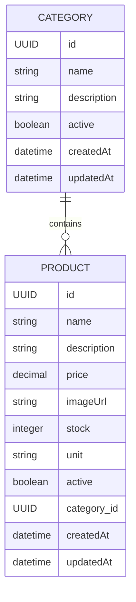

# Faz 2: Category Sistemi + Entity İlişkileri

**Proje:** Mini Food Delivery Backend  
**Faz:** N fazdan 2.  
**Odak:** Category entity + Product -> Category ilişkisi  
**Henüz yok:** Sepet, sipariş, ödeme, kullanıcıya özel ürün listesi

> Bu rehber, Faz 1'de kurulan Product CRUD altyapısının üzerine inşa edilir. Bu fazın ana amacı, artık tek tabloyla değil, **birbiriyle ilişkili iki tabloyla** çalışmayı öğrenmektir.

> **Dokümantasyon kaynağı:** Bu rehberdeki Spring Data JPA repository yaklaşımı ve `findBy...` query method örnekleri, Context7 üzerinden çekilen güncel **Spring Data JPA** dokümantasyonuna dayandırılmıştır: `/spring-projects/spring-data-jpa`.

---

## İçindekiler

1. [Bu Fazın Amacı](#1-bu-fazın-amacı)
2. [Category Sistemi Gerçek Projelerde Neden Önemlidir?](#2-category-sistemi-gerçek-projelerde-neden-önemlidir)
3. [Bu Fazda İnşa Edilecek Yapı](#3-bu-fazda-inşa-edilecek-yapı)
4. [Entity'ler](#4-entityler)
5. [İlişki Mantığı](#5-ilişki-mantığı)
6. [Veritabanı Şeması](#6-veritabanı-şeması)
7. [Adım Adım Uygulama](#7-adım-adım-uygulama)
8. [API Endpoint'leri](#8-api-endpointleri)
9. [DTO Kullanımı: Bu Fazda Neden Daha Önemli?](#9-dto-kullanımı-bu-fazda-neden-daha-önemli)
10. [Yaygın Hatalar](#10-yaygın-hatalar)
11. [Bu Fazda Neler Öğreneceksiniz](#11-bu-fazda-neler-öğreneceksiniz)
12. [Sözlük](#12-sözlük)

---

## 1. Bu Fazın Amacı

Faz 1'de sistemde sadece `Product` vardı. Bu bilinçli olarak basit tutuldu; önce entity, repository, service, controller ve DTO akışı öğrenildi.

Faz 2'de artık ürünleri kategorilere bağlayacaksınız.

Örnek:

| Category | Products |
| -------- | -------- |
| Pizza | Margherita Pizza, Pepperoni Pizza |
| Burger | Cheeseburger, Chicken Burger |
| Drink | Ayran, Cola, Water |

Bu fazda hedeflenen kazanımlar:

- `Category` adında yeni bir entity oluşturmak
- `Product` entity'sine kategori ilişkisi eklemek
- `@ManyToOne` ve `@OneToMany` anotasyonlarını öğrenmek
- Foreign key mantığını anlamak
- Repository'de ilişkili veri sorgulamak
- Service katmanında iki entity'yi birlikte yönetmek
- DTO'larda entity ilişkilerini güvenli şekilde göstermek
- JSON response içinde circular reference problemini önlemek

> **Bu fazın kuralı:** Sepet ve sipariş sistemine geçmeden önce ürünlerin hangi kategoriye ait olduğunu düzgün modelleyin. Gerçek backend projelerinde büyük yapıların temeli doğru entity ilişkileridir.

---

## 2. Category Sistemi Gerçek Projelerde Neden Önemlidir?

Kategori sistemi küçük görünür ama gerçek dünyada çok temel bir yapıdır.

Bir yemek sipariş uygulamasında kullanıcı genelde tüm ürünleri karışık görmek istemez. Menü şu şekilde bölünür:

- Pizzalar
- Burgerler
- Tatlılar
- İçecekler
- Kampanyalı ürünler

Bu ayrım sadece ekranda düzen sağlamak için değildir. Backend tarafında da önemli faydaları vardır.

### 2.1 Kullanıcı deneyimi

Mobil uygulama veya web arayüzü ürünleri kategoriye göre listeler.

Örnek:

```http
GET /api/v1/categories
GET /api/v1/categories/{categoryId}/products
```

Böylece frontend önce kategorileri çeker, kullanıcı bir kategori seçtiğinde sadece o kategoriye ait ürünleri listeler.

### 2.2 Yönetim paneli

Restoran sahibi veya admin paneli ürünleri kategoriye göre yönetir.

Örnek işlemler:

- "Pizza" kategorisine yeni ürün ekleme
- "İçecekler" kategorisini pasife alma
- "Tatlılar" kategorisindeki ürünleri listeleme
- Yanlış kategoriye atanmış ürünü düzeltme

### 2.3 Veri organizasyonu

Kategori yoksa ürün tablosu büyüdükçe kontrol zorlaşır.

Kötü yaklaşım:

| product_name | category_name |
| ------------ | ------------- |
| Margherita Pizza | Pizza |
| Pepperoni Pizza | pizza |
| Cheeseburger | Burger |
| Cola | Drinks |
| Ayran | Drink |

Burada kategori adı ürün satırının içinde string olarak tutulursa aynı kategori farklı şekillerde yazılabilir: `Drink`, `Drinks`, `drink`, `İçecek`.

Doğru yaklaşım:

- Kategoriler ayrı tabloda tutulur.
- Product sadece `category_id` ile kategoriye bağlanır.
- Kategori adı tek yerde saklanır.

### 2.4 Gelecek fazlara hazırlık

İleride sepet ve sipariş sistemi geldiğinde ürünlerin kategori bilgisi hâlâ önemli olacak.

Örnek:

- "İçeceklerde %20 indirim"
- "Tatlı kategorisinden bir ürün alana kampanya"
- "Restoran menüsünü kategori bazlı göster"
- "En çok satan kategori raporu"

Kategori sistemi bu yüzden sadece basit bir listeleme özelliği değil, ilerideki iş kurallarının temelidir.

---

## 3. Bu Fazda İnşa Edilecek Yapı

Bu faz sonunda sistemde iki ana entity olacak:



Okunuşu:

- Bir `Category`, birden fazla `Product` içerebilir.
- Bir `Product`, yalnızca bir `Category`'ye ait olur.
- İlişki veritabanında `products.category_id` kolonu ile tutulur.

---

## 4. Entity'ler

### 4.1 Product

`Product`, satılan ürünü temsil eder.

Örnek ürünler:

- Margherita Pizza
- Cheeseburger
- Ayran
- Tiramisu

Faz 1'de `Product` tek başına duruyordu. Faz 2'de artık bir kategoriye bağlanır.

Bu fazdaki Product alanları:

| Alan | Tip | Açıklama |
| ---- | --- | -------- |
| `id` | UUID | BaseEntity'den gelir |
| `name` | String | Ürün adı |
| `description` | String | Ürün açıklaması |
| `price` | BigDecimal | Ürün fiyatı |
| `imageUrl` | String | Ürün görsel adresi |
| `stock` | Integer | Stok miktarı |
| `unit` | String | Adet, porsiyon, litre gibi birim |
| `active` | Boolean | Ürün aktif mi? |
| `category` | Category | Ürünün bağlı olduğu kategori |
| `createdAt` | LocalDateTime | BaseEntity'den gelir |
| `updatedAt` | LocalDateTime | BaseEntity'den gelir |

Entity örneği:

```java
package com.cavus.delivery_food.product.entity;

import com.cavus.delivery_food.category.entity.Category;
import com.cavus.delivery_food.entity.BaseEntity;
import jakarta.persistence.Column;
import jakarta.persistence.Entity;
import jakarta.persistence.FetchType;
import jakarta.persistence.JoinColumn;
import jakarta.persistence.ManyToOne;
import jakarta.persistence.Table;
import lombok.Getter;
import lombok.Setter;

import java.math.BigDecimal;

@Getter
@Setter
@Entity
@Table(name = "products")
public class Product extends BaseEntity {

    @Column(nullable = false)
    private String name;

    @Column(length = 500)
    private String description;

    @Column(nullable = false, precision = 10, scale = 2)
    private BigDecimal price;

    @Column(length = 255)
    private String imageUrl;

    @Column(nullable = false)
    private Integer stock = 0;

    @Column(length = 20)
    private String unit;

    @Column(nullable = false)
    private Boolean active = true;

    @ManyToOne(fetch = FetchType.LAZY)
    @JoinColumn(name = "category_id")
    private Category category;
}
```

> **Yeni başlayan notu:** `Product` tablosunda kategori bilgisi doğrudan kategori adı olarak tutulmaz. Onun yerine `category_id` tutulur. Bu ID, `categories` tablosundaki bir satırı gösterir.

### 4.2 Category

`Category`, ürünleri gruplayan yapıdır.

Örnek kategoriler:

- Pizza
- Burger
- Drink
- Dessert

Bu fazdaki Category alanları:

| Alan | Tip | Açıklama |
| ---- | --- | -------- |
| `id` | UUID | BaseEntity'den gelir |
| `name` | String | Kategori adı |
| `description` | String | Kategori açıklaması |
| `active` | Boolean | Kategori aktif mi? |
| `products` | List<Product> | Bu kategoriye bağlı ürünler |
| `createdAt` | LocalDateTime | BaseEntity'den gelir |
| `updatedAt` | LocalDateTime | BaseEntity'den gelir |

Entity örneği:

```java
package com.cavus.delivery_food.category.entity;

import com.cavus.delivery_food.entity.BaseEntity;
import com.cavus.delivery_food.product.entity.Product;
import jakarta.persistence.Column;
import jakarta.persistence.Entity;
import jakarta.persistence.OneToMany;
import jakarta.persistence.Table;
import lombok.Getter;
import lombok.Setter;

import java.util.ArrayList;
import java.util.List;

@Getter
@Setter
@Entity
@Table(name = "categories")
public class Category extends BaseEntity {

    @Column(nullable = false, unique = true, length = 100)
    private String name;

    @Column(length = 500)
    private String description;

    @Column(nullable = false)
    private Boolean active = true;

    @OneToMany(mappedBy = "category")
    private List<Product> products = new ArrayList<>();
}
```

> **Yeni başlayan notu:** `@OneToMany(mappedBy = "category")` demek, "Bu ilişkinin asıl foreign key tarafı Product içindeki `category` alanıdır" demektir. Veritabanında `categories` tablosunda `product_id` tutulmaz.

---

## 5. İlişki Mantığı

Bu fazdaki ilişki şudur:

> One Category has many Products.  
> Product belongs to one Category.

Türkçe okunuşu:

> Bir kategori birçok ürüne sahip olabilir.  
> Bir ürün bir kategoriye aittir.

### 5.1 Java tarafı

Java tarafında ilişki iki sınıf arasında kurulur:

```java
// Product.java
@ManyToOne(fetch = FetchType.LAZY)
@JoinColumn(name = "category_id")
private Category category;
```

```java
// Category.java
@OneToMany(mappedBy = "category")
private List<Product> products = new ArrayList<>();
```

### 5.2 Veritabanı tarafı

Veritabanında ilişki `products` tablosundaki `category_id` kolonu ile kurulur.

Basit gösterim:

```text
categories
----------
id
name
description
active
created_at
updated_at

products
--------
id
name
description
price
image_url
stock
unit
active
category_id  -> categories.id
created_at
updated_at
```

### 5.3 İlişkinin sahibi kim?

JPA'da iki yönlü ilişkilerde önemli bir kavram vardır: **owning side**.

Bu projede ilişkinin sahibi `Product` tarafıdır.

Çünkü foreign key burada tutulur:

```text
products.category_id
```

Bu yüzden `Product` tarafında `@JoinColumn` vardır.

`Category` tarafındaki `mappedBy = "category"` ise şunu söyler:

> Bu ilişkiyi ben yönetmiyorum. Product sınıfındaki `category` alanı yönetiyor.

---

## 6. Veritabanı Şeması

Bu faz sonunda veritabanında iki tablo olacaktır.

### 6.1 categories tablosu

| Kolon | Tip | Kural |
| ----- | --- | ----- |
| `id` | UUID | Primary key |
| `name` | varchar(100) | Not null, unique |
| `description` | varchar(500) | Nullable |
| `active` | boolean | Not null |
| `created_at` | timestamp | BaseEntity |
| `updated_at` | timestamp | BaseEntity |

Örnek veri:

| id | name | description | active |
| -- | ---- | ----------- | ------ |
| `c1...` | Pizza | Pizza ürünleri | true |
| `c2...` | Burger | Burger ürünleri | true |

### 6.2 products tablosu

| Kolon | Tip | Kural |
| ----- | --- | ----- |
| `id` | UUID | Primary key |
| `name` | varchar | Not null |
| `description` | varchar(500) | Nullable |
| `price` | numeric(10,2) | Not null |
| `image_url` | varchar(255) | Nullable |
| `stock` | integer | Not null |
| `unit` | varchar(20) | Nullable |
| `active` | boolean | Not null |
| `category_id` | UUID | Foreign key |
| `created_at` | timestamp | BaseEntity |
| `updated_at` | timestamp | BaseEntity |

Örnek veri:

| name | price | category_id |
| ---- | ----- | ----------- |
| Margherita Pizza | 12.99 | Pizza kategorisinin ID'si |
| Pepperoni Pizza | 14.99 | Pizza kategorisinin ID'si |
| Cheeseburger | 10.99 | Burger kategorisinin ID'si |

### 6.3 SQL mantığı

JPA sizin yerinize tablo oluşturabilir, ama arka planda fikir şu şekildedir:

```sql
CREATE TABLE categories (
    id UUID PRIMARY KEY,
    name VARCHAR(100) NOT NULL UNIQUE,
    description VARCHAR(500),
    active BOOLEAN NOT NULL,
    created_at TIMESTAMP,
    updated_at TIMESTAMP
);

ALTER TABLE products
ADD COLUMN category_id UUID;

ALTER TABLE products
ADD CONSTRAINT fk_products_category
FOREIGN KEY (category_id)
REFERENCES categories(id);
```

> **Yeni başlayan notu:** Foreign key, veritabanının "Bu ürünün bağlı olduğu kategori gerçekten var mı?" diye kontrol etmesini sağlar. Olmayan bir kategori ID'si ile ürün bağlamaya çalışırsanız veritabanı bunu engeller.

---

## 7. Adım Adım Uygulama

Bu bölümde dosya dosya nasıl ilerleyeceğiniz anlatılır.

Önerilen paket yapısı:

```text
src/main/java/com/cavus/delivery_food
├── category
│   ├── controller
│   │   └── CategoryController.java
│   ├── dto
│   │   ├── CategoryRequest.java
│   │   └── CategoryResponse.java
│   ├── entity
│   │   └── Category.java
│   ├── mapper
│   │   └── CategoryMapper.java
│   ├── repository
│   │   └── CategoryRepository.java
│   └── service
│       ├── CategoryNotFoundException.java
│       └── CategoryService.java
└── product
    ├── controller
    │   └── ProductController.java
    ├── dto
    │   ├── ProductRequest.java
    │   └── ProductResponse.java
    ├── entity
    │   └── Product.java
    ├── mapper
    │   └── ProductMapper.java
    ├── repository
    │   └── ProductRepository.java
    └── service
        └── ProductService.java
```

### 7.1 Category entity oluştur

Dosya:

```text
src/main/java/com/cavus/delivery_food/category/entity/Category.java
```

Kod:

```java
package com.cavus.delivery_food.category.entity;

import com.cavus.delivery_food.entity.BaseEntity;
import com.cavus.delivery_food.product.entity.Product;
import jakarta.persistence.Column;
import jakarta.persistence.Entity;
import jakarta.persistence.OneToMany;
import jakarta.persistence.Table;
import lombok.Getter;
import lombok.Setter;

import java.util.ArrayList;
import java.util.List;

@Getter
@Setter
@Entity
@Table(name = "categories")
public class Category extends BaseEntity {

    @Column(nullable = false, unique = true, length = 100)
    private String name;

    @Column(length = 500)
    private String description;

    @Column(nullable = false)
    private Boolean active = true;

    @OneToMany(mappedBy = "category")
    private List<Product> products = new ArrayList<>();
}
```

Önemli noktalar:

- `@Entity`: Bu sınıf veritabanı tablosudur.
- `@Table(name = "categories")`: Tablo adını net verir.
- `name unique`: Aynı kategori adından iki tane olmasın.
- `products`: Bu kategoriye bağlı ürünleri temsil eder.
- `mappedBy`: Foreign key'in Product tarafında olduğunu söyler.

### 7.2 Product entity güncelle

Mevcut `Product` entity'sine category alanı eklenir.

Eklenmesi gereken importlar:

```java
import com.cavus.delivery_food.category.entity.Category;
import jakarta.persistence.FetchType;
import jakarta.persistence.JoinColumn;
import jakarta.persistence.ManyToOne;
```

Eklenmesi gereken alan:

```java
@ManyToOne(fetch = FetchType.LAZY)
@JoinColumn(name = "category_id")
private Category category;
```

Tam ilişki mantığı:

- `@ManyToOne`: Birçok ürün, bir kategoriye bağlanabilir.
- `fetch = FetchType.LAZY`: Ürün çekildiğinde kategori otomatik yüklenmesin; gerektiğinde yüklensin.
- `@JoinColumn(name = "category_id")`: `products` tablosuna `category_id` kolonu eklenir.

> **Mimari not:** `ManyToOne` ilişkilerde genellikle `FetchType.LAZY` tercih edilir. Böylece her ürün listelendiğinde kategori nesnesi gereksiz yere yüklenmez.

### 7.3 Category DTO'larını oluştur

Entity'yi doğrudan dış dünyaya açmak yerine DTO kullanın.

Dosya:

```text
src/main/java/com/cavus/delivery_food/category/dto/CategoryRequest.java
```

```java
package com.cavus.delivery_food.category.dto;

import jakarta.validation.constraints.NotBlank;
import jakarta.validation.constraints.Size;
import lombok.AllArgsConstructor;
import lombok.Data;
import lombok.NoArgsConstructor;

@Data
@NoArgsConstructor
@AllArgsConstructor
public class CategoryRequest {

    @NotBlank(message = "Kategori adı boş olamaz")
    @Size(max = 100, message = "Kategori adı en fazla 100 karakter olabilir")
    private String name;

    @Size(max = 500, message = "Kategori açıklaması en fazla 500 karakter olabilir")
    private String description;

    private Boolean active = true;
}
```

Dosya:

```text
src/main/java/com/cavus/delivery_food/category/dto/CategoryResponse.java
```

```java
package com.cavus.delivery_food.category.dto;

import lombok.AllArgsConstructor;
import lombok.Data;
import lombok.NoArgsConstructor;

@Data
@NoArgsConstructor
@AllArgsConstructor
public class CategoryResponse {

    private String id;
    private String name;
    private String description;
    private Boolean active;
}
```

> **Neden `products` listesi response içinde yok?** Çünkü kategori listesi çekerken her kategoriyle birlikte tüm ürünleri de döndürmek performans açısından risklidir. Ayrıca `Category -> Product -> Category -> Product` şeklinde circular reference hatası doğurabilir.

### 7.4 Product DTO'larını category bilgisiyle güncelle

Ürün oluştururken kategori ID'si göndermek istiyorsanız `ProductRequest` içine `categoryId` ekleyin.

```java
private UUID categoryId;
```

Gerekli import:

```java
import java.util.UUID;
```

Response tarafında ise kategori bilgisini sade göstermek daha doğrudur.

Önerilen `ProductResponse` category alanları:

```java
private String categoryId;
private String categoryName;
```

Böylece response şu şekilde olur:

```json
{
  "success": true,
  "code": 200,
  "message": "Ürün başarıyla getirildi",
  "data": {
    "id": "product-uuid",
    "name": "Margherita Pizza",
    "price": 12.99,
    "categoryId": "category-uuid",
    "categoryName": "Pizza"
  }
}
```

> **Mimari not:** Response içine tüm `Category` entity'sini koymak yerine sadece gereken alanları koymak daha kontrollüdür.

### 7.5 CategoryRepository oluştur

Dosya:

```text
src/main/java/com/cavus/delivery_food/category/repository/CategoryRepository.java
```

Kod:

```java
package com.cavus.delivery_food.category.repository;

import com.cavus.delivery_food.category.entity.Category;
import org.springframework.data.jpa.repository.JpaRepository;

import java.util.Optional;
import java.util.UUID;

public interface CategoryRepository extends JpaRepository<Category, UUID> {

    Optional<Category> findByName(String name);

    boolean existsByName(String name);
}
```

Spring Data JPA burada metot isimlerinden sorgu üretir.

Context7 üzerinden kontrol edilen Spring Data JPA dokümantasyonunda da bu yaklaşım gösterilir:

```java
List<User> findByLastname(String lastname);
User findByEmailAddress(String emailAddress);
```

Bu projeye uyarlarsak:

```java
Optional<Category> findByName(String name);
boolean existsByName(String name);
```

Yani elle SQL yazmadan Spring Data JPA metot adından sorguyu türetir.

### 7.6 ProductRepository güncelle

Mevcut repository:

```java
public interface ProductRepository extends JpaRepository<Product, UUID> {
}
```

Bu fazda kategoriye göre ürün listelemek için ek metot ekleyin:

```java
package com.cavus.delivery_food.product.repository;

import com.cavus.delivery_food.product.entity.Product;
import org.springframework.data.jpa.repository.JpaRepository;

import java.util.List;
import java.util.UUID;

public interface ProductRepository extends JpaRepository<Product, UUID> {

    List<Product> findByCategoryId(UUID categoryId);
}
```

Bu metot şunu ifade eder:

> Product tablosunda category id'si verilen ID'ye eşit olan ürünleri getir.

Spring Data JPA bu metodu otomatik sorguya çevirir.

### 7.7 CategoryMapper oluştur

Projede `ProductMapper` için MapStruct kullanıldığı için Category tarafında da aynı yaklaşımı kullanmak tutarlı olur.

Dosya:

```text
src/main/java/com/cavus/delivery_food/category/mapper/CategoryMapper.java
```

Kod:

```java
package com.cavus.delivery_food.category.mapper;

import com.cavus.delivery_food.category.dto.CategoryRequest;
import com.cavus.delivery_food.category.dto.CategoryResponse;
import com.cavus.delivery_food.category.entity.Category;
import org.mapstruct.Mapper;
import org.mapstruct.Mapping;
import org.mapstruct.MappingTarget;

import java.util.List;

@Mapper(componentModel = "spring")
public interface CategoryMapper {

    @Mapping(target = "id", ignore = true)
    @Mapping(target = "createdAt", ignore = true)
    @Mapping(target = "updatedAt", ignore = true)
    @Mapping(target = "products", ignore = true)
    Category toEntity(CategoryRequest request);

    CategoryResponse toCategoryResponse(Category category);

    List<CategoryResponse> toCategoryResponseList(List<Category> categories);

    @Mapping(target = "id", ignore = true)
    @Mapping(target = "createdAt", ignore = true)
    @Mapping(target = "updatedAt", ignore = true)
    @Mapping(target = "products", ignore = true)
    void updateCategoryFromRequest(CategoryRequest request, @MappingTarget Category category);
}
```

Önemli detay:

```java
@Mapping(target = "products", ignore = true)
```

Category oluştururken dışarıdan ürün listesi almıyoruz. Ürünler ayrı endpoint ile kategoriye bağlanacak.

### 7.8 ProductMapper güncelle

`ProductResponse` içine `categoryId` ve `categoryName` eklediğinizde MapStruct'a bu alanların nereden geleceğini söylemeniz gerekir.

Örnek:

```java
@Mapping(source = "category.id", target = "categoryId")
@Mapping(source = "category.name", target = "categoryName")
ProductResponse toProductResponse(Product product);
```

Liste dönüşümü aynı kalabilir:

```java
List<ProductResponse> toProductResponseList(List<Product> products);
```

Eğer `ProductRequest` içinde `categoryId` varsa `toEntity` sırasında bunu doğrudan `category` entity'sine map etmeyin. Çünkü sadece ID gelmiştir; gerçek `Category` nesnesini service katmanında repository ile bulmanız gerekir.

Bu yüzden `toEntity` için category ignore edilebilir:

```java
@Mapping(target = "id", ignore = true)
@Mapping(target = "createdAt", ignore = true)
@Mapping(target = "updatedAt", ignore = true)
@Mapping(target = "category", ignore = true)
Product toEntity(ProductRequest productRequest);
```

Update için de benzer şekilde:

```java
@Mapping(target = "id", ignore = true)
@Mapping(target = "createdAt", ignore = true)
@Mapping(target = "updatedAt", ignore = true)
@Mapping(target = "category", ignore = true)
void updateProductFromRequest(ProductRequest request, @MappingTarget Product product);
```

> **Mimari not:** DTO'dan gelen `categoryId`, mapper'da değil service katmanında çözülmelidir. Çünkü mapper veritabanına gitmemelidir.

### 7.9 CategoryService oluştur

Dosya:

```text
src/main/java/com/cavus/delivery_food/category/service/CategoryService.java
```

Kod:

```java
package com.cavus.delivery_food.category.service;

import com.cavus.delivery_food.category.dto.CategoryRequest;
import com.cavus.delivery_food.category.dto.CategoryResponse;
import com.cavus.delivery_food.category.entity.Category;
import com.cavus.delivery_food.category.mapper.CategoryMapper;
import com.cavus.delivery_food.category.repository.CategoryRepository;
import org.springframework.stereotype.Service;
import org.springframework.transaction.annotation.Transactional;

import java.util.List;
import java.util.UUID;

@Service
@Transactional
public class CategoryService {

    private final CategoryRepository categoryRepository;
    private final CategoryMapper categoryMapper;

    public CategoryService(CategoryRepository categoryRepository, CategoryMapper categoryMapper) {
        this.categoryRepository = categoryRepository;
        this.categoryMapper = categoryMapper;
    }

    public CategoryResponse create(CategoryRequest request) {
        if (categoryRepository.existsByName(request.getName())) {
            throw new IllegalArgumentException("Bu kategori adı zaten kullanılıyor: " + request.getName());
        }

        Category category = categoryMapper.toEntity(request);
        Category savedCategory = categoryRepository.save(category);

        return categoryMapper.toCategoryResponse(savedCategory);
    }

    @Transactional(readOnly = true)
    public List<CategoryResponse> findAll() {
        List<Category> categories = categoryRepository.findAll();
        return categoryMapper.toCategoryResponseList(categories);
    }

    @Transactional(readOnly = true)
    public Category getEntityById(UUID categoryId) {
        return categoryRepository.findById(categoryId)
                .orElseThrow(() -> new CategoryNotFoundException(categoryId));
    }
}
```

`getEntityById` neden response değil entity döndürüyor?

Çünkü `ProductService`, ürün ile kategori ilişkisi kurarken gerçek `Category` entity'sine ihtiyaç duyar:

```java
Category category = categoryService.getEntityById(categoryId);
product.setCategory(category);
```

### 7.10 CategoryNotFoundException oluştur

Dosya:

```text
src/main/java/com/cavus/delivery_food/category/service/CategoryNotFoundException.java
```

Kod:

```java
package com.cavus.delivery_food.category.service;

import java.util.UUID;

public class CategoryNotFoundException extends RuntimeException {

    public CategoryNotFoundException(UUID id) {
        super("Kategori bulunamadı: " + id);
    }
}
```

İsterseniz Faz 1'deki `ProductExceptionHandler` yaklaşımına benzer şekilde `CategoryExceptionHandler` da oluşturabilirsiniz.

### 7.11 ProductService güncelle

`ProductService`, artık ürün oluştururken veya ürünü kategoriye atarken `CategoryRepository` veya `CategoryService` kullanmalıdır.

Temiz yaklaşım:

- `ProductService`, `CategoryService` üzerinden category entity'sini ister.
- Category yoksa `CategoryNotFoundException` fırlatılır.
- Category varsa product içine set edilir.

Constructor'a `CategoryService` eklenir:

```java
private final CategoryService categoryService;

public ProductService(
        ProductRepository productRepository,
        ProductMapper productMapper,
        CategoryService categoryService) {
    this.productRepository = productRepository;
    this.productMapper = productMapper;
    this.categoryService = categoryService;
}
```

Ürün oluştururken category bağlama:

```java
@Transactional
public ProductResponse create(ProductRequest request) {
    Product entity = productMapper.toEntity(request);

    if (request.getCategoryId() != null) {
        Category category = categoryService.getEntityById(request.getCategoryId());
        entity.setCategory(category);
    }

    Product savedProduct = productRepository.save(entity);
    return productMapper.toProductResponse(savedProduct);
}
```

Ürünü kategoriye atama metodu:

```java
@Transactional
public ProductResponse assignCategory(UUID productId, UUID categoryId) {
    Product product = productRepository.findById(productId)
            .orElseThrow(() -> new ProductNotFoundException(productId));

    Category category = categoryService.getEntityById(categoryId);
    product.setCategory(category);

    Product savedProduct = productRepository.save(product);
    return productMapper.toProductResponse(savedProduct);
}
```

Kategoriye göre ürün listeleme:

```java
@Transactional(readOnly = true)
public List<ProductResponse> findByCategory(UUID categoryId) {
    categoryService.getEntityById(categoryId);

    List<Product> products = productRepository.findByCategoryId(categoryId);
    return productMapper.toProductResponseList(products);
}
```

> **Neden önce category var mı diye kontrol ediyoruz?** Çünkü kategori yoksa boş liste dönmek yanıltıcı olabilir. `categoryId` yanlışsa 404 dönmek daha doğru bir API davranışıdır.

### 7.12 CategoryController oluştur

Dosya:

```text
src/main/java/com/cavus/delivery_food/category/controller/CategoryController.java
```

Kod:

```java
package com.cavus.delivery_food.category.controller;

import com.cavus.delivery_food.category.dto.CategoryRequest;
import com.cavus.delivery_food.category.dto.CategoryResponse;
import com.cavus.delivery_food.category.service.CategoryService;
import com.cavus.delivery_food.common.response.BaseResponse;
import jakarta.validation.Valid;
import org.springframework.http.ResponseEntity;
import org.springframework.web.bind.annotation.GetMapping;
import org.springframework.web.bind.annotation.PostMapping;
import org.springframework.web.bind.annotation.RequestBody;
import org.springframework.web.bind.annotation.RequestMapping;
import org.springframework.web.bind.annotation.RestController;
import org.springframework.web.servlet.support.ServletUriComponentsBuilder;

import java.net.URI;
import java.util.List;

@RestController
@RequestMapping("/api/v1/categories")
public class CategoryController {

    private final CategoryService categoryService;

    public CategoryController(CategoryService categoryService) {
        this.categoryService = categoryService;
    }

    @PostMapping
    public ResponseEntity<BaseResponse<CategoryResponse>> create(
            @Valid @RequestBody CategoryRequest request) {
        CategoryResponse createdCategory = categoryService.create(request);

        URI location = ServletUriComponentsBuilder.fromCurrentRequest()
                .path("/{id}")
                .buildAndExpand(createdCategory.getId())
                .toUri();

        return ResponseEntity.created(location)
                .body(BaseResponse.success(201, "Kategori başarıyla oluşturuldu", createdCategory));
    }

    @GetMapping
    public ResponseEntity<BaseResponse<List<CategoryResponse>>> getAllCategories() {
        List<CategoryResponse> categories = categoryService.findAll();
        return ResponseEntity.ok(BaseResponse.success(200, "Kategoriler başarıyla listelendi", categories));
    }
}
```

### 7.13 ProductController güncelle

Mevcut `ProductController` içine iki endpoint eklenir.

Ürünü kategoriye atama:

```java
@PutMapping("/{productId}/category/{categoryId}")
public ResponseEntity<BaseResponse<ProductResponse>> assignCategory(
        @PathVariable UUID productId,
        @PathVariable UUID categoryId) {
    ProductResponse product = productService.assignCategory(productId, categoryId);
    return ResponseEntity.ok(BaseResponse.success(200, "Ürün kategoriye başarıyla atandı", product));
}
```

Kategoriye göre ürün listeleme için iki yaklaşım vardır.

Önerilen yaklaşım:

```java
@GetMapping("/by-category/{categoryId}")
public ResponseEntity<BaseResponse<List<ProductResponse>>> getProductsByCategory(
        @PathVariable UUID categoryId) {
    List<ProductResponse> products = productService.findByCategory(categoryId);
    return ResponseEntity.ok(BaseResponse.success(200, "Kategoriye ait ürünler listelendi", products));
}
```

Alternatif REST yaklaşımı:

```http
GET /api/v1/categories/{categoryId}/products
```

Bu daha okunabilir olabilir, ama ürün listeleme logic'i `ProductService` içinde kalmalıdır.

---

## 8. API Endpoint'leri

Bu fazda minimum dört endpoint beklenir.

### 8.1 Create category

```http
POST /api/v1/categories
```

Request:

```json
{
  "name": "Pizza",
  "description": "Pizza ürünleri",
  "active": true
}
```

Response:

```json
{
  "success": true,
  "code": 201,
  "message": "Kategori başarıyla oluşturuldu",
  "data": {
    "id": "category-uuid",
    "name": "Pizza",
    "description": "Pizza ürünleri",
    "active": true
  }
}
```

### 8.2 Get categories

```http
GET /api/v1/categories
```

Response:

```json
{
  "success": true,
  "code": 200,
  "message": "Kategoriler başarıyla listelendi",
  "data": [
    {
      "id": "category-uuid-1",
      "name": "Pizza",
      "description": "Pizza ürünleri",
      "active": true
    },
    {
      "id": "category-uuid-2",
      "name": "Burger",
      "description": "Burger ürünleri",
      "active": true
    }
  ]
}
```

### 8.3 Assign product to category

```http
PUT /api/v1/products/{productId}/category/{categoryId}
```

Örnek:

```http
PUT /api/v1/products/0f7b58c5-b56f-4d53-8f1a-42fe2cf4b2b8/category/92d0c0c2-bc56-4cf1-b71a-75ed18f3e45d
```

Response:

```json
{
  "success": true,
  "code": 200,
  "message": "Ürün kategoriye başarıyla atandı",
  "data": {
    "id": "product-uuid",
    "name": "Margherita Pizza",
    "description": "Domates, mozzarella, fesleğen",
    "price": 12.99,
    "imageUrl": null,
    "stock": 20,
    "unit": "adet",
    "active": true,
    "categoryId": "category-uuid",
    "categoryName": "Pizza"
  }
}
```

### 8.4 Get products by category

```http
GET /api/v1/products/by-category/{categoryId}
```

Örnek:

```http
GET /api/v1/products/by-category/92d0c0c2-bc56-4cf1-b71a-75ed18f3e45d
```

Response:

```json
{
  "success": true,
  "code": 200,
  "message": "Kategoriye ait ürünler listelendi",
  "data": [
    {
      "id": "product-uuid-1",
      "name": "Margherita Pizza",
      "price": 12.99,
      "categoryId": "category-uuid",
      "categoryName": "Pizza"
    },
    {
      "id": "product-uuid-2",
      "name": "Pepperoni Pizza",
      "price": 14.99,
      "categoryId": "category-uuid",
      "categoryName": "Pizza"
    }
  ]
}
```

### 8.5 Endpoint özeti

| Method | URL | Amaç |
| ------ | --- | ---- |
| `POST` | `/api/v1/categories` | Yeni kategori oluşturur |
| `GET` | `/api/v1/categories` | Kategorileri listeler |
| `PUT` | `/api/v1/products/{productId}/category/{categoryId}` | Ürünü kategoriye atar |
| `GET` | `/api/v1/products/by-category/{categoryId}` | Kategoriye ait ürünleri listeler |

---

## 9. DTO Kullanımı: Bu Fazda Neden Daha Önemli?

Faz 1'de DTO zaten kullanıldı, ama tek entity olduğu için DTO'nun önemi daha az hissedilmiş olabilir. Faz 2'de DTO kullanmak kritik hale gelir.

Çünkü artık entity'ler birbirini referans eder:

```text
Category -> products -> Product -> category -> Category -> products -> ...
```

Entity'leri doğrudan JSON olarak döndürürseniz şu problemler çıkabilir:

- Sonsuz döngü
- Lazy loading hatası
- Gereğinden büyük response
- Frontend'e veritabanı modelinin sızması
- Hassas veya gereksiz alanların dışarı açılması

### 9.1 Kötü response örneği

Category entity'sini doğrudan dönerseniz şöyle bir yapı oluşabilir:

```json
{
  "id": "category-uuid",
  "name": "Pizza",
  "products": [
    {
      "id": "product-uuid",
      "name": "Margherita Pizza",
      "category": {
        "id": "category-uuid",
        "name": "Pizza",
        "products": [
          {
            "id": "product-uuid",
            "name": "Margherita Pizza"
          }
        ]
      }
    }
  ]
}
```

Bu yapı büyüyerek devam edebilir.

### 9.2 Doğru response örneği

DTO ile response kontrollü olur:

```json
{
  "id": "product-uuid",
  "name": "Margherita Pizza",
  "price": 12.99,
  "categoryId": "category-uuid",
  "categoryName": "Pizza"
}
```

Burada frontend ihtiyacı olan bilgiyi alır, ama entity grafiği dışarı açılmaz.

### 9.3 Request DTO ve Response DTO ayrımı

Request DTO:

```java
public class ProductRequest {
    private String name;
    private BigDecimal price;
    private UUID categoryId;
}
```

Response DTO:

```java
public class ProductResponse {
    private String id;
    private String name;
    private BigDecimal price;
    private String categoryId;
    private String categoryName;
}
```

Request içinde `categoryId` yeterlidir. Client tüm category nesnesini göndermemelidir.

Response içinde ise `categoryName` eklemek frontend için kullanışlıdır. Frontend tekrar category adı çekmek zorunda kalmaz.

---

## 10. Yaygın Hatalar

### 10.1 Entity'yi direkt controller'dan döndürmek

Kötü:

```java
@GetMapping
public List<Category> getCategories() {
    return categoryRepository.findAll();
}
```

Neden kötü?

- Entity dış dünyaya açılır.
- Circular reference olabilir.
- Lazy loading problemleri yaşanabilir.
- Response formatını kontrol etmek zorlaşır.

Doğru:

```java
@GetMapping
public ResponseEntity<BaseResponse<List<CategoryResponse>>> getAllCategories() {
    List<CategoryResponse> categories = categoryService.findAll();
    return ResponseEntity.ok(BaseResponse.success(200, "Kategoriler başarıyla listelendi", categories));
}
```

### 10.2 `@OneToMany` tarafına `@JoinColumn` koymak

Bu projede foreign key `products.category_id` kolonundadır. Bu yüzden ilişkiyi `Product` tarafı yönetir.

Doğru:

```java
// Product.java
@ManyToOne(fetch = FetchType.LAZY)
@JoinColumn(name = "category_id")
private Category category;
```

```java
// Category.java
@OneToMany(mappedBy = "category")
private List<Product> products = new ArrayList<>();
```

### 10.3 `LAZY` ilişkiyi yanlış yerde tetiklemek

`FetchType.LAZY`, ilişkili entity'nin hemen yüklenmemesini sağlar.

Örnek:

```java
@ManyToOne(fetch = FetchType.LAZY)
private Category category;
```

Bu performans için iyidir, ama transaction dışında `product.getCategory().getName()` çağırırsanız lazy loading hatası alabilirsiniz.

Pratik çözüm:

- Entity'yi controller'da dolaşmayın.
- DTO dönüşümünü service transaction içindeyken yapın.
- Gerekiyorsa repository'de `@Query` veya `@EntityGraph` gibi daha ileri teknikleri sonraki fazlarda öğrenin.

### 10.4 Circular reference

`Category` içinde `products`, `Product` içinde `category` varsa JSON çevirici sonsuz döngüye girebilir.

Problem:

```text
Category
  -> Product
      -> Category
          -> Product
              -> Category
```

DTO bu problemi temiz şekilde çözer.

### 10.5 Category ID yerine category name ile ilişki kurmak

Kötü:

```java
private String categoryName;
```

Neden kötü?

- Kategori adı değişirse ürünlerle bağlantı bozulur.
- Aynı isim farklı yazılabilir.
- Veritabanı referans bütünlüğü sağlayamaz.

Doğru:

```java
@ManyToOne(fetch = FetchType.LAZY)
@JoinColumn(name = "category_id")
private Category category;
```

### 10.6 Mapper içinde repository kullanmak

Kötü fikir:

```java
// Mapper içinde categoryRepository.findById(...)
```

Mapper'ın görevi veri dönüştürmektir. Veritabanına gitmek service katmanının sorumluluğudur.

Doğru akış:

```text
Controller -> Service -> Repository
                 |
                 -> Mapper
```

### 10.7 Olmayan categoryId ile ürün oluşturmak

Request:

```json
{
  "name": "Margherita Pizza",
  "price": 12.99,
  "categoryId": "olmayan-category-id"
}
```

Bu durumda doğru davranış:

```http
404 Not Found
```

Mesaj:

```json
{
  "success": false,
  "code": 404,
  "message": "Kategori bulunamadı: olmayan-category-id",
  "data": null
}
```

---

## 11. Bu Fazda Neler Öğreneceksiniz

Bu fazı tamamladığınızda aşağıdaki konuları pratik etmiş olacaksınız:

- Bir projeye yeni entity ekleme
- İki entity arasında ilişki kurma
- `@ManyToOne` kullanımı
- `@OneToMany` kullanımı
- `@JoinColumn` ile foreign key tanımlama
- `mappedBy` kavramı
- Lazy loading mantığı
- Spring Data JPA derived query method kullanımı
- `findByCategoryId(UUID categoryId)` gibi ilişkili sorgular
- DTO ile circular reference engelleme
- Service katmanında entity ilişkisi yönetme
- Controller'da ilişkili endpoint tasarlama
- Gerçek dünyaya daha yakın veritabanı modelleme

Bu fazın sonunda backend artık "tek tablo CRUD" seviyesinden çıkar ve gerçek uygulamalarda kullanılan temel ilişki modeline geçer.

---

## 12. Sözlük

| Terim | Açıklama |
| ----- | -------- |
| Entity | Veritabanı tablosunu temsil eden Java sınıfı |
| Relationship | Entity'ler arasındaki bağlantı |
| OneToMany | Bir kaydın birçok kayıtla ilişkili olması |
| ManyToOne | Birçok kaydın tek bir kayda bağlanması |
| Foreign key | Bir tablodaki kaydın başka tablodaki kayda referans vermesi |
| Owning side | İlişkinin foreign key'i yöneten tarafı |
| `mappedBy` | İlişkinin diğer entity'deki hangi alanla yönetildiğini belirtir |
| `@JoinColumn` | Foreign key kolonunun adını belirtir |
| Lazy loading | İlişkili verinin ihtiyaç olana kadar yüklenmemesi |
| DTO | API request/response için kullanılan veri taşıma modeli |
| Circular reference | İki entity'nin birbirini sonsuz şekilde referans etmesi |

---

## Faz 2 Kontrol Listesi

Bu faz tamamlandı sayılmadan önce şunları kontrol edin:

- `Category` entity oluşturuldu.
- `Product` entity içine `category` ilişkisi eklendi.
- `CategoryRepository` oluşturuldu.
- `ProductRepository` içine `findByCategoryId(UUID categoryId)` eklendi.
- `CategoryRequest` ve `CategoryResponse` oluşturuldu.
- `ProductRequest` içine `categoryId` eklendi.
- `ProductResponse` içine `categoryId` ve `categoryName` eklendi.
- `CategoryMapper` oluşturuldu.
- `ProductMapper` category alanlarını doğru map ediyor.
- `CategoryService` oluşturuldu.
- `ProductService` ürün-kategori atamasını yönetiyor.
- `POST /api/v1/categories` çalışıyor.
- `GET /api/v1/categories` çalışıyor.
- `PUT /api/v1/products/{productId}/category/{categoryId}` çalışıyor.
- `GET /api/v1/products/by-category/{categoryId}` çalışıyor.
- Entity'ler doğrudan controller response'u olarak dönmüyor.
- Circular reference oluşmuyor.

---

## Sonraki Faz İçin Hazırlık

Faz 2 tamamlandığında sistemde artık ürünler kategorilere bağlıdır.

Bu temel üzerine sonraki fazlarda şunlar inşa edilebilir:

- Kullanıcı sistemi
- Sepet sistemi
- Sipariş sistemi
- Restoran veya mağaza modeli
- Kategori bazlı kampanyalar
- Ürün arama ve filtreleme

Bu yüzden Faz 2 küçük görünse de backend mimarisi açısından kritik bir adımdır.
